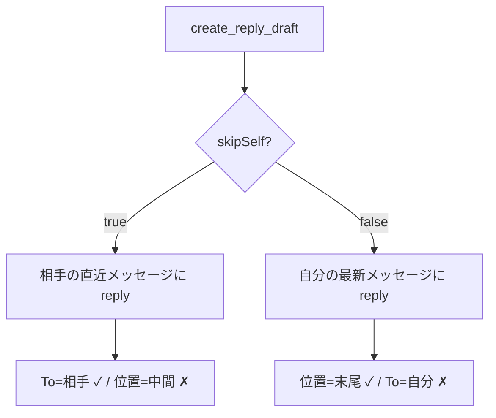

## 概要

`create_reply_draft` で「下書きをスレッド末尾に配置する」ことと「To を自分以外（相手）にする」ことを両立したい、という要望。現状の GmailApp reply 系メソッドでは構造的に両立できない。本 issue は **要望・技術調査・見送り判断** を記録し、同じ検討の堂々巡り（特に「Advanced Service を使えば解決する」という再提案）を防ぐことを目的とする。

## 出典

2026-05-25、別 AI セッションでの返信下書き作成テスト（竹林さん宛）。「スレッド末尾に下書きを付ける」形を狙ったところ、以下のトレードオフが実機で確定した。

| 設定 | スレッド内の位置 | 宛先 |
|---|---|---|
| `skipSelf:true`（デフォルト） | 相手の直近メッセージの位置＝中間に表示 | to=相手 ✓ |
| `skipSelf:false` | 末尾に付く ✓ | to=自分 ✗ |

実機スクリーンショットで「`skipSelf:false` → 下書きはスレッド末尾、ただし To が自分（oishi）」を確認済み。

## 詳細

### 構造的原因

- `create_reply_draft` は `skipSelf` で「どのメッセージに reply するか」を選ぶだけ。reply 先の To は GmailApp が自動決定する（`createDraftReply` = 元の送信者、`createDraftReplyAll` = 送信者＋全受信者）。
- GmailApp の `createDraftReply(body, options)` / `createDraftReplyAll(body, options)` の advanced parameters は `attachments / bcc / cc / from / htmlBody / inlineImages / name / replyTo / subject` の9個で、**`to` は存在しない**（[公式リファレンス](https://developers.google.com/apps-script/reference/gmail/gmail-message) で確認、2026-05-25）。よって options で To を上書きできない。
- `gas-template/handlers/draft.js` の `handleUpdateDraft` に `if (to) options.to = to;`（L266）があるが、GmailApp が `options.to` を無視するため、reply draft の To は変わらない（#118 で「`update_draft` cannot change the recipient on a reply draft either」と明記済み）。
- このトレードオフは **#046（skipSelf / replyAll 導入）の時点で構造的に発生**したもの。#086（replyAll 時の CC 自己除外）で「reply 系の宛先は options で自由制御できず、利用側で組み立てる必要がある」ことが既に判明していた。

### 技術的に可能な実装（参考）

Gmail Advanced Service（Gmail API `users.drafts.create`）で **raw MIME ドラフト** を作り、`In-Reply-To` / `References` ヘッダに自分の最新メッセージの `Message-ID` を設定すれば、「スレッド末尾への紐付け」＋「任意の To」を両立できる。

- **OAuth 権限**: `users.drafts.create` は `https://mail.google.com/` / `gmail.modify` / `gmail.compose` のいずれかで呼べる（[公式](https://developers.google.com/gmail/api/reference/rest/v1/users.drafts/create) 確認、2026-05-25）。`appsscript.json` は `gmail.modify` と `gmail.compose` を既に保持しているため、**追加 OAuth スコープは不要**（認可ダイアログも変わらない）。

## 方針

### 見送り判断（2026-05-25）

権限は増えないが、以下の **複雑性コスト** に見合わないため見送る。

1. `appsscript.json` への Advanced Service dependency（`enabledAdvancedServices`）追加
2. GCP 側の Gmail API 有効化が `install` 体験に絡む可能性（環境依存）
3. raw MIME の自前組み立て（ヘッダ付与・MIME エンコード・base64url 化）のメンテ負担

「スレッド末尾＋To=相手」は稀なエッジケースであり、Gmail UI で To を手直しすれば足りる。CLAUDE.md「必要最低限の実装で最大効果」に従い、機能追加は行わない。

### 暫定運用

- 両立が必要な場合は、Gmail UI で自分の送信メッセージの「返信」ボタンから作成する（UI は自分の送信メッセージへの返信では To を元の宛先＝相手にする）
- または `create_reply_draft`（`skipSelf:true`）で作成後、Gmail UI で To / 位置を手直しする

## スコープ外

- 機能の実装そのもの（本 issue は見送り判断の記録）
- `skipSelf` / `replyAll` のデフォルト挙動変更

## 完了条件

本 issue は記録目的のため、以下を満たした時点で「保留（記録済み）」とする。

- [x] トレードオフの構造的原因が記録されている
- [x] Advanced Service による実装可否・必要権限が調査・記録されている
- [x] 見送り判断と理由（複雑性コスト）が記録されている
- [x] 暫定運用が記録されている
- [ ] （再検討の場合のみ）両立ニーズの頻発が確認された

### 再検討の条件

両立ニーズが頻発した場合のみ再検討する。その際は「追加権限なしで Advanced Service 実装が可能」と判明済みのため、複雑性コストとの比較から議論を始めればよい。

## 関連情報

- **#118**: draft 系 API 制約の相互参照強化（本 issue の親。スコープ外として To 上書き機能をここに切り出した）
- **#046**: `create_reply_draft` の自己返信問題を修正（skipSelf / replyAll 導入）— 本トレードオフの起点
- **#086**: replyAll 時の CC 自己除外 — reply 系の宛先制御の限界が判明した issue

## 作業記録

- 2026-05-25: #118 のコミット前議論から派生。技術調査（GmailApp reply options・Gmail API drafts.create スコープ）を実施し、見送り判断とともに起票。
