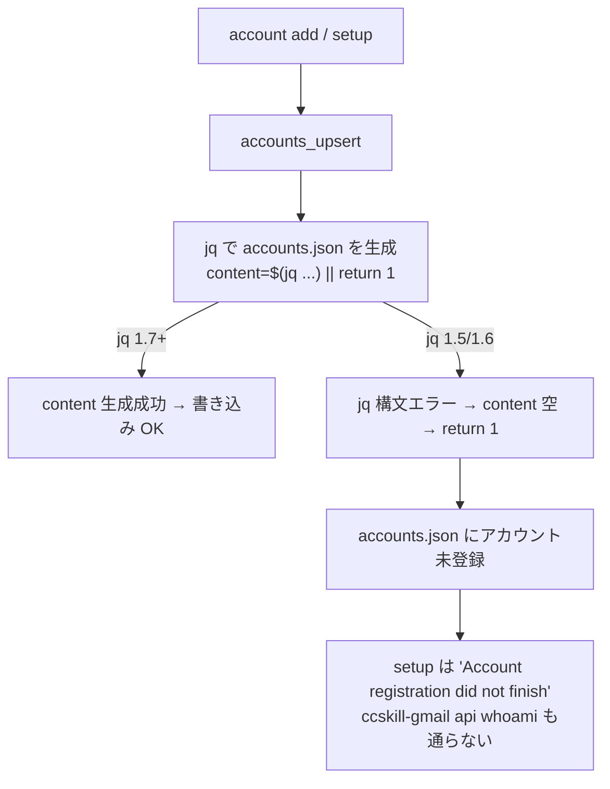

## 概要

`ccskill-gmail setup`（および `account add`）の最終段で、ローカルの `accounts.json` に
アカウント情報を書き込む jq が **古い jq を持つマシンで構文エラー**になり、アカウント登録が
完了しない不具合。原因は `lib/accounts.sh` の jq プログラムがオブジェクトキーに jq の予約語
`label` を裸（引用符なし）で使っていること。


## 出典

利用者マシンでの `ccskill-gmail setup` 実行時に発生したエラー（ユーザ報告）。

```
jq: error: syntax error, unexpected label, expecting IDENT or __loc__ (Unix shell quoting issues?) at <top-level>, line 2:
          label: (if $label == "" then null else $label end),
jq: 1 compile error

Account registration did not finish.
Re-run it any time with: ccskill-gmail account add
```

- 発生マシンの jq: **jq-1.5**（ユーザ確認済み）
- 開発マシンの jq: jq-1.7.1-apple（裸の `label:` を受理するため再現せず）


## 詳細

### 根本原因

`lib/accounts.sh` の `accounts_upsert` 内、`accounts.json` を書き込む jq プログラム（153 行目）:

```jq
.accounts[$email] = {
   label: (if $label == "" then null else $label end),   # ← ここ
   clasp_user: $clasp_user,
   ...
}
```

`label` は jq の予約語（`label $out | … break $out` の制御構文用）。jq 1.7 でオブジェクトキーに
予約語を使えるよう緩和されたが、**jq 1.6 以前（1.5 含む）は `label` を予約語トークンとして扱い、
裸のオブジェクトキーとして拒否する**。エラーメッセージ `unexpected label, expecting IDENT` が
まさにこの状態。

### 影響



GAS 側（Google のプロジェクト作成・デプロイ）は成功しているため、ローカルの登録だけが欠落する。

### 他の予約語キーの有無

`lib/accounts.sh:153` の `label` が唯一の jq 予約語キー。`clasp_user` 等は非予約語。
`gas-template/**/*.js` の `label:` は GAS 側の JavaScript であり jq とは無関係（JS では `label` は
通常のキー）。


## 方針

jq のオブジェクトキーを引用符で囲む。全 jq バージョンで通り、挙動は不変。予約語を裸キーに
使わない方針を静的テストで担保し、再発を防ぐ。


## 実装内容

`lib/accounts.sh`:

```diff
-          label: (if $label == "" then null else $label end),
+          "label": (if $label == "" then null else $label end),
```

回帰テスト `tests/lib/test-accounts-jq-reserved.sh`（新規）:
- `lib/*.sh` の jq プログラムに jq 予約語（`label` 等）が裸のオブジェクトキーとして
  残っていないことを静的に検査する。開発マシンの jq が寛容（1.7）でも捕捉できるよう
  実行時ではなく静的検査とする。


## スコープ外

- jq 自体のバージョン要件の引き上げ・doctor での jq バージョン警告追加は本 issue では扱わない
  （必要なら別 issue）。
- 既に古い jq で登録に失敗したマシンのリカバリ手順の整備（`account add` 再実行で解消するため）。


## 完了条件

- [ ] `lib/accounts.sh` の `label` キーが quote されている
- [ ] 回帰テスト（新規）が追加され、修正前は fail・修正後は pass する
- [ ] 既存の `tests/lib/test-account-label.sh` / `test-accounts.sh` が pass する
- [ ] jq 1.5 相当の厳格パースで構文エラーにならないことを確認する


## 関連情報

- #123（中央アカウントレジストリ + account コマンド）で導入された `accounts_upsert`
- #138（account add の認証後ラベル指定）の `tests/lib/test-account-label.sh`


## 作業記録

- 2026-07-05: 起票。ユーザ報告のエラーと jq-1.5 の予約語仕様から根本原因を特定。
  ブランチ `fix/147-jq-reserved-label-key` を作成。
- 2026-07-05: TDD で回帰テスト `tests/lib/test-accounts-jq-reserved.sh` を先に追加し
  RED（`lib/accounts.sh:153` を検出）を確認。`lib/accounts.sh:153` の `label:` を
  `"label":` に quote 修正。新テスト 4件・既存 `test-account-label.sh` 10件・
  `test-accounts.sh` 13件すべて pass。`commands/` 側に同種の裸予約語キーがないことも確認。
  （コミット前）
