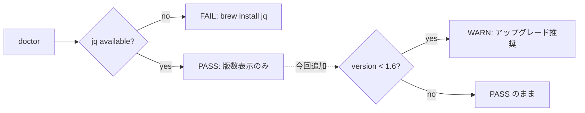

## 概要

`ccskill-gmail doctor` の jq チェックで、jq のバージョンが古い（1.6 未満）場合に
警告を表示し、アップグレードを促す。#147 の jq 1.5 起因のアカウント登録失敗のような
バージョン依存の不具合を、環境診断の段階で早期に気づけるようにする（再発防止）。


## 出典

#147（jq 1.5 で `label` 予約語キーがエラーになりアカウント登録が失敗した不具合）の
再発防止策として、ユーザから doctor での jq バージョン警告の追加を依頼された。


## 詳細

現状 `commands/doctor.sh` の jq チェック（85-93 行目付近）は「jq があるか」と
バージョン文字列の表示のみで、古いバージョンの注意喚起がない。



`jq --version` の出力例: `jq-1.7.1-apple` / `jq-1.6` / `jq-1.5`。
`jq-` プレフィックスと末尾サフィックス（`-apple` 等）を除き、`major.minor` を比較する。


## 方針

- doctor の jq チェックに「1.6 未満なら WARN」を追加する（FAIL ではなく WARN）。
- しきい値はユーザ指定の 1.6。1.6 未満で「一部の jq 構文が古い版では動作せず、
  過去にアカウント登録が失敗した事例がある（#147）。`brew upgrade jq` を推奨」と案内。
- バージョン比較は純粋な文字列解析（jq に依存しない小さな bash 関数）で行い、単体テスト可能にする。


## 実装内容

`commands/doctor.sh` の jq チェックにバージョン比較を追加。比較ロジックは
`lib/` の小関数に切り出してテスト可能にする（例: `jq_version_lt "$ver" "1.6"`）。

```sh
# 例: jq-1.7.1-apple → "1.7" を取り出し、1.6 と比較
jq_version_is_old() {   # 引数: jq --version の生出力 / 返り値: 0=古い(<1.6)
    local raw="$1" ver major minor
    ver=${raw#jq-}                 # jq- 除去
    ver=${ver%%-*}                 # -apple 等のサフィックス除去
    major=${ver%%.*}
    minor=${ver#*.}; minor=${minor%%.*}
    [ -z "$major" ] && return 1
    [ "$major" -lt 1 ] 2>/dev/null && return 0
    [ "$major" -eq 1 ] && [ "${minor:-0}" -lt 6 ] 2>/dev/null && return 0
    return 1
}
```

単体テスト `tests/lib/test-jq-version.sh`（新規）で境界値
（1.5→古い / 1.6→OK / 1.7.1-apple→OK / 不明形式→誤警告しない）を検証。


## スコープ外

- jq を FAIL 扱いにして doctor を失敗させること（#147 修正後は 1.5 でも動作するため、
  あくまで WARN に留める）。
- setup / account add の実行時（doctor 以外）でのバージョン警告。必要なら別途検討。


## 完了条件

- [x] doctor が jq < 1.6 で WARN を表示し、アップグレード手順を案内する
- [x] バージョン比較関数の単体テストが追加され pass する
- [x] jq 1.7.1-apple（開発環境）では警告が出ない（誤検知しない）
- [x] 不明・空のバージョン文字列で誤警告しない


## 関連情報

- #147（jq 予約語キーの修正）— 本 issue の直接の契機
- `commands/doctor.sh` の jq チェック


## 作業記録

- 2026-07-05: 起票（#147 の再発防止依頼）。TDD で `tests/lib/test-jq-version.sh` を先に追加し
  RED を確認 → `lib/jq_version.sh`（`jq_version_is_old`）を実装し GREEN。`commands/doctor.sh` の
  jq チェックに WARN 分岐を追加（1.6 未満で「brew upgrade jq」を案内、#147 参照）。
  実機 doctor で jq-1.7.1-apple が PASS（誤警告なし）、jq-1.5 模擬で WARN が正しく表示されることを確認。
  関連 lib テスト（jq-version / accounts-jq-reserved / account-label / accounts）すべて pass。
- 2026-07-05: feat コミット c9ff51e。`fix/147-jq-reserved-label-key` を main へ
  `--no-ff` マージ（965c99e）。完了。
