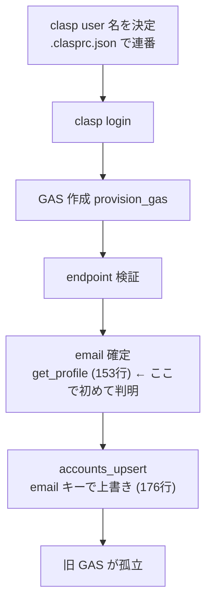

## 概要

`ccskill-gmail account add` は、既に登録済みの Google アカウント（メール）を再度 add しても
弾かず、**新しい GAS プロジェクトを作成してから** accounts.json の該当エントリを上書きする。
結果、旧 GAS プロジェクトが黙って孤立する。ログイン直後（GAS 作成前）にメールを確定し、
既登録なら中断・案内するガードを入れて、孤立 GAS の量産を防ぐ。

## 出典

#147-149（jq 1.5 の登録失敗）調査中に、失敗リトライで GAS プロジェクトが乱立した事象を
きっかけにユーザーと議論。GAS は「ログインした Google アカウント側」に作られるため、
別アカウント同士は Apps Script 一覧が分かれて衝突しない。同一一覧に重複が並ぶのは
「同一アカウントを重複 add したとき」だけであり、それは命名で見分ける話ではなく
`account add` 側で弾くべき、という整理に至った。

## 詳細

### 現状の流れ（`commands/account.sh` cmd_add）

- clasp user の連番ロジック（`account.sh:101-108`）が見るのは `.clasprc.json`（clasp ログイン名）で、
  **登録済みメールではない**。
- `accounts_get "$EMAIL"`（`account.sh:171`）は参照されるが、用途は「ラベルを対話で尋ねるか」の
  判定のみで、**重複を拒否していない**。
- email は GAS 作成後（`account.sh:153`）に判明するため、既登録メールの再 add で
  新 GAS を作ってしまい、旧 GAS が孤立する。

### 併せて検討

- ログイン直後にメールを取れるか: `_clasp login` は「You are logged in as X」を表示。
  `_clasp show-authorized-user` の出力からメールを取得できるか実装時に検証する。
- `--user` 明示時・非対話（自動実行）時の挙動、`--force`/`--yes` 相当で意図的な再作成を
  許すかどうかも検討する。

## 方針

**GAS を作成する前に**メールを確定し、accounts.json と照合する。既登録なら既定で中断し、
再デプロイ導線（`account update`）と置き換え導線（`account remove` → `add`）を案内する。

## 実装内容（実装時に詳細化）

- `commands/account.sh` cmd_add: `_clasp login` 後、provisioning 前に
  `_clasp show-authorized-user` からメールを取得 → `accounts_get "$EMAIL"` で既登録判定。
- 既登録なら:
  - endpoint/label を提示し「既に登録済み。再デプロイは `account update`、置き換えは
    `account remove <email>` 後に再 add」と案内して exit（GAS 未作成のまま）。
- メール取得ロジックは lib の小関数に切り出し、出力パースを単体テスト可能にする。

## スコープ外

- 既に存在する孤立 GAS の自動削除（引き続き手動。skill は GAS 削除機能を持たない方針）。
- `account update`（既存アカウントの再デプロイ）自体の挙動変更。

## 完了条件

- [x] GAS 作成前にメールを確定し、既登録メールの再 add を既定で中断する
- [x] 中断時に再デプロイ／置き換えの導線を案内する（update / remove / --force）
- [x] 新規メールは従来どおり登録できる（guard は既登録時のみ発火。email 不明時は fail-open）
- [x] メール取得・判定ロジックの単体テストが追加され pass する

## 関連情報

- #151（GAS プロジェクト名の短縮 + マシン名付与）— 本 issue とセットで議論された姉妹 issue
- `commands/account.sh` cmd_add / `lib/accounts.sh` accounts_get

## 作業記録

- 2026-07-05: 起票（#147-149 の GAS 乱立を機にユーザーと整理）。#150→#151 の順で着手予定。
- 2026-07-05: 実装。`lib/clasp.sh` に `clasp_parse_authorized_email`（`show-authorized-user`
  出力からメール抽出）と `clasp_authorized_email` を追加。単体テスト `tests/lib/test-clasp-email.sh`
  を TDD で先行（RED→GREEN、6件 pass）。`commands/account.sh` cmd_add に `--force` と
  ガードを追加：ログイン後・GAS 作成前にメールを確定し、`accounts_get` で既登録なら
  update / remove / --force を案内して中断（GAS 未作成）。ブランチ `fix/150-account-add-dedup`。
- 2026-07-05: 実機検証（sandbox 無効）。`ccskill-gmail account add --user ccskill-acct-main`
  （既登録 oishi@feedtailor.jp）でガードが発火し **GAS を作らず中断**することを確認。
  関連テスト（clasp-email / accounts / account-label / jq-reserved / jq-version）すべて pass。（コミット前）
