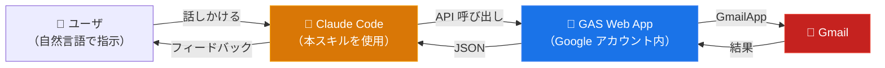

# ccskill-gmail

**Gmail での作業を、もっともっと楽にする。**

ccskill-gmail は、Claude Code 標準の Gmail コネクタ (MCP) を補完するスキルです。標準コネクタでは不可能な、添付ファイルのダウンロード・メール本文の PDF 化・プロンプトインジェクション対策のほか、Claude Code による操作ログの記録、複数 Gmail アカウントの使い分けにも対応しています。

日常的な検索・閲覧・返信下書き作成のみであれば、標準 Gmail コネクタの方が使いやすい可能性がありますが、本スキルにも同じ機能が備わっていますので標準スキルの代わりとして使用することもできます。

## 機能比較

| 機能 / タスク | 標準コネクタ | Workspace MCP (プレビュー) | ccskill-gmail |
|---|:---:|:---:|:---:|
| メールの検索と内容の確認 | ○ | ○ | ○ |
| メールの下書き作成 | ○ | ○ | ○ |
| ラベルの付与・削除 | × | ○ | ○ |
| ゴミ箱への移動 | × | × | ○ |
| アーカイブ | × | × | ○ |
| 未読・既読のトグル | × | × | ○ |
| スター付与 | × | × | ○ |
| 添付ファイルのダウンロード | × | × | ○ |
| メール本文の PDF 化 | × | × | ○ |
| プロンプトインジェクション対策（HTML メール中の隠しプロンプトの無効化） | × | × | ○ |
| メール操作の監査ログ | × | × | ○ |
| マルチアカウント対応 | × | × | ○ |
| Gmail 連携スクリプトの開発 | × | × | ○ |

出典: [Claude 公式ドキュメント「Google Workspace コネクタを使用する」](https://support.claude.com/en/articles/10166901-use-google-workspace-connectors) / [Google「Workspace MCP サーバーを構成する」](https://developers.google.com/workspace/guides/configure-mcp-servers?hl=ja)

## 特徴的な機能

### 添付ファイルのダウンロード

添付ファイルをダウンロードできます。メール本文に応じたファイル名で保存したり、添付ファイルの内容を踏まえた作業を指示することができます。

### メール本文のPDFファイル化

メール本文をPDFファイルとして保存できます。HTMLメール・テキストメールの両方に対応しています。

### 複数アカウント対応

標準の Gmail コネクタは Claude に紐付いた一つのアカウントにしかアクセスできませんが、ccskill-gmail は任意の数の Gmail アカウントを中央登録し、デフォルト指定と呼び出し単位の切り替えができます。

```bash
ccskill-gmail account add --label work      # アカウント登録（各 1 回）
ccskill-gmail account add --label personal

ccskill-gmail api get action=get_profile                     # デフォルトアカウント
ccskill-gmail api --account personal get action=get_profile  # 呼び出し単位で切替
```

Claude Code には「個人アカウントのほうで確認して」のように話すだけで切り替わります。特定のディレクトリを特定のアカウントに固定（ピン留め）することもできます:

```bash
cd /path/to/work-project
ccskill-gmail bind work     # このディレクトリは常に work アカウントを操作
```

### 操作履歴の記録と振り返り

ccskill-gmail が行った作業を振り返ることができます。

本スキルによるメール検索・内容取得・下書き作成・添付ダウンロード等の全ての操作をローカル監査ログ(JSONL形式)で保存することにより実現しています。

記録されるのは操作名とthread IDのみで、件名・本文・宛先等は記録しません。Claude Code に振り返りを指示した時に thread ID を頼りに情報を取得する設計になっています。

### Gmail を使う独自スクリプトの開発

`ccskill-gmail api` コマンドは、どこからでも呼べる Gmail 操作スクリプトとして機能します。このコマンドを使って、Gmail と連携するプログラムを Claude Code に開発してもらうことができます。OAuthを前提とする GCP のAPIキーの発行は不要です。

### セキュリティ

- **送信機能はありません。** Claude Code が下書きを作成し、送信はユーザが Gmail から手動で行う設計です（標準コネクタも同じ思想）
- **ゴミ箱移動はデフォルト無効。** 必要な場合は `config.js` でオプトインしてください
- **プロンプトインジェクション対策。** HTML メールに埋め込まれた隠し指示（CSS 非表示・ゼロ幅文字・白文字等）は、GAS 層で無効化してから AI に渡します
- **Googleアカウント認証前提。** Google アカウントで認証することを前提とした作りになっています。

## 具体的な使用例

### 添付ファイルの領収書を整理

> 「○○社からの領収書メールを直近半年分探して、添付PDFを `20260401_取引先名_税込金額_receipt.pdf` の形式で保存して」

### 過去のメールやり取りの整理

> 「○○社の○○さんとのやり取りを全て遡り、経緯・残タスク・仕掛かりを含む引き継ぎ資料を作成して。一覧はExcelで」

> 「○○システムの障害対応メールを過去1年分調べて、発生日・原因・対処法の一覧を作って」

### 文脈をふまえた返信メール下書き

> 「過去1ヶ月で返信していない取引先メールを洗い出して、相手先・件名・放置日数の一覧を作って。重要なものにはフォローアップの下書きも作って」

### 作業の振り返り

> 「先週○○をお願いした件を時系列でまとめてください」

### 不要メールのアーカイブ

> 「メーリングリストや通知系メールを抽出して、送信元・頻度・最終受信日の一覧を作って。3ヶ月以上未読が放置されているメールはアーカイブして」

### 独自スクリプトの開発

> 「スパムらしきメールを検索して送信元ドメインを抽出するスクリプトを作って」

> 「今月届いた請求書メールから PDF 添付を一括ダウンロードするスクリプトを書いて」

> 「毎日の未読メールサマリーを Markdown で出力するスクリプトを生成して」

## 必要なもの・前提条件

- Google アカウント (個人用 / GoogleWorksspace)
- Node.js / npm
- jq
- Google Apps Script API の有効化 (初めて GAS を使う場合には [Google Apps Script API の設定](https://script.google.com/home/usersettings) をオンにする必要があります)

## インストール

### 1. スキルの入手

**git clone の場合:**

```bash
cd ~/projects
git clone https://github.com/feedtailor/ccskill-gmail.git
```

**zip 配布の場合:**

```bash
cd ~/projects
unzip ccskill-gmail-XXXXXX.zip
```

### 2. セットアップスクリプトの実行

clasp のインストール、PATH 登録、Google ログインを行います。

```bash
cd ~/projects/ccskill-gmail
./ccskill-gmail setup
```

### 3. Gmail アカウントの登録

使いたい Gmail アカウントを登録します（アカウントごとに 1 回）。GAS プロジェクトの作成・デプロイは自動で行われます。途中で Google の認証のためブラウザが開きますので「許可」してください。

```bash
ccskill-gmail account add
```

### 4. スキルの全プロジェクト登録

```bash
ccskill-gmail skill install
```

ccskill-gmail を Claude Code の**ユーザースキル**（`~/.claude/skills/`）として登録します。これにより、この Mac 上のどのプロジェクトでもプロジェクト単位のインストールなしで Claude Code から Gmail を扱えるようになります。

### 5. 確認

```bash
ccskill-gmail api whoami
ccskill-gmail api get action=get_profile
```

`whoami` は「いまのディレクトリからの呼び出しがどのアカウントに解決されるか（とその理由）」を、`get_profile` はアカウントのメールアドレスと未読数を返します。

### （任意）プロジェクト単位のセットアップ

特定のプロジェクトディレクトリを特定アカウントに固定したい場合や、そのプロジェクトでの Claude Code の確認プロンプトを減らしたい場合は、対象ディレクトリで `install` を実行します:

```bash
cd /path/to/your-project
ccskill-gmail install                  # デフォルトアカウントに固定 + ファイル配置 + permission 設定
ccskill-gmail install --account work   # 特定の登録済みアカウントに固定
```

このとき新しい GAS プロジェクトは**作成されません**（登録済みアカウントへのピン留めと、スキルファイルの配置・permission 設定のみ）。プロジェクト専用の GAS デプロイが必要な上級ユースケース（プロジェクト別の `config.js` 権限制御など）では `ccskill-gmail install --dedicated` を使ってください。

## 更新

ccskill-gmail は機能追加や不具合修正で更新されることがあります。

### git clone の場合

ccskill-gmail をインストールしたディレクトリで `git pull` を実行したのち、アップデートコマンドを実行してください。アカウント共有 GAS の更新**と**、インストール済み全プロジェクトの更新を行います。

```bash
cd ~/projects/ccskill-gmail
git pull
ccskill-gmail update-all
```

（`ccskill-gmail skill install` で登録したユーザースキルは本リポジトリへの symlink のため、`git pull` した時点で最新になっています。）

アカウント共有 GAS のみ、またはプロジェクト単位の個別アップデートもできます。

```bash
ccskill-gmail account update          # 全登録アカウントの共有 GAS
cd /path/to/your-project/
ccskill-gmail update                  # プロジェクト 1 つ
```

### zip 配布の場合

新しい zip をダウンロードし、プロジェクトディレクトリに展開した後、`ccskill-gmail update` で反映してください。

## 旧バージョン（中央化前）からの移行

以前のバージョンは、プロジェクトディレクトリごとに専用の GAS デプロイをインストールする方式でした（各ディレクトリで `ccskill-gmail install` が必須）。中央アカウントレジストリ化以降は、アカウントを一度登録すれば全ディレクトリで共有されます。**旧バージョンから更新した場合でも、何も壊れず、対応は不要です** — 集約したい場合のみ以下をお読みください。

### opt-in しない限り何も変わらない

既存のプロジェクト単位インストールは従来どおりそのまま動作します。プロジェクトの `.ccskill-gmail/api` は自身の `.ccskill-metadata.json`（レガシーバインド）で解決し、中央レジストリには一切触れません。そのまま使い続けて問題ありません。

### 中央レジストリへの集約（任意）

すべてを1つの中央アカウント一覧で管理したい場合:

```bash
ccskill-gmail account add              # アカウントを中央登録（一度だけ。既存の認可を再利用）
ccskill-gmail migrate --dry-run        # どのプロジェクトをどのアカウントにバインドするかをプレビュー
ccskill-gmail migrate                  # レガシーインストールを email でグルーピングし、代表デプロイを
                                       #   登録、各プロジェクトに binding.json を書く
ccskill-gmail unbind --purge-legacy    # （任意・プロジェクトごと）レガシーインストールファイルを削除し
                                       #   中央デフォルトアカウントに従わせる
```

- `migrate` は**再認可しません**（認可済み GAS を再利用）。また**何も削除しません** — 余剰なプロジェクト専用デプロイは [script.google.com](https://script.google.com) での手動削除のために*一覧表示するだけ*です。カスタムした `config.js` の権限設定は引き継がれます。
- レガシーメタデータは残置されます。削除は `unbind --purge-legacy` のときだけ（監査ログは保持されます）。

### 注意: 同じアカウントが2つのデプロイを指すことがある

移行後、あるディレクトリは（`binding.json` 経由で）**中央共有 GAS** を解決する一方、古い**専用 GAS** も残っている、という状態になり得ます。同じ Gmail アカウントですが、デプロイの実体は別物です。変更や操作が「反映されない」と感じたら、どのエンドポイントを叩いているか確認してください:

```bash
ccskill-gmail api whoami               # アカウント・解決元・エンドポイントを表示
```

## アンインストール

```bash
ccskill-gmail uninstall          # プロジェクト単位のインストールを削除
ccskill-gmail skill uninstall    # ユーザースキル登録を解除
ccskill-gmail account remove <email|label>   # アカウント登録を解除
```

`uninstall` はローカルのプロジェクトファイル（`.ccskill-gmail/`、スキル定義、パーミッション設定）を削除します。Google Apps Script のプロジェクトは自動削除されないため、[script.google.com](https://script.google.com) から手動で削除してください。

## その他のコマンド

```bash
ccskill-gmail help                # 全コマンドの表示
ccskill-gmail api whoami          # いまのディレクトリがどのアカウントに解決されるか表示
ccskill-gmail account list        # 登録アカウントの一覧
ccskill-gmail account default <email|label>  # デフォルトアカウントの変更
ccskill-gmail bind <email|label>  # いまのディレクトリをアカウントに固定
ccskill-gmail unbind [--purge-legacy]  # 固定の解除（レガシー install の掃除も可）
ccskill-gmail migrate             # 中央レジストリ以前の install を移行
ccskill-gmail info [--json]       # 現在のプロジェクトの詳細表示（アカウント、権限、未読数）
ccskill-gmail status [--refresh]  # インストール状況の一覧表示
ccskill-gmail doctor              # 環境・セットアップの診断
ccskill-gmail history [--all]     # API 操作の監査ログ表示
ccskill-gmail apply-config        # config.js の変更を GAS に反映（専用 GAS の install 向け）
ccskill-gmail register <PATH>     # 既存インストールの登録
ccskill-gmail release             # 配布用 zip ファイルの作成
```

## 複数アカウント利用

各アカウントをラベル付きで 1 回ずつ登録します。ラベルには英数字・ハイフン・アンダースコアのみ使用できます（例: `work`, `personal2`, `info-ft`）。アカウントごとに Google ログインが必要です。

```bash
ccskill-gmail account add --label work
ccskill-gmail account add --label personal
ccskill-gmail account list                  # * がデフォルト
ccskill-gmail account default personal     # デフォルトの変更
```

呼び出しごとのアカウント決定は 3 通りです（優先順）:

1. **明示指定**: `ccskill-gmail api --account work get ...` — Claude Code には依頼文でアカウント名を言うだけ
2. **ディレクトリ固定**: `ccskill-gmail bind work` — そのディレクトリでの操作は常に work アカウント
3. **デフォルト**: 上記以外はデフォルトアカウント

`ccskill-gmail api whoami` で「どのアカウントが・なぜ選ばれるか」をいつでも確認できます。

## 技術情報

### 構造

ccskill-gmail は、GCP の Gmail API を使用しません。その代わり、認証ユーザのみが使用できるブリッジ API を GAS プロジェクトとしてデプロイします。これを Claude Code が使用する構造となっています。



GAS Web App は登録 Google アカウントごとに 1 つデプロイされ、全ディレクトリで共有されます。操作対象のアカウントは呼び出しごとに「明示の `--account` > ディレクトリ固定（`bind`） > デフォルトアカウント」の順で決まります。各 Web App へのアクセスはデプロイした Google アカウント自身（MYSELF）に制限されます。


### 権限について

セットアップ中、Google から権限の許可を求められます。

**clasp 関連の権限（セットアップ時）**

| 権限 | 用途 |
|---|---|
| Google Drive ファイルの参照・管理 | GAS プロジェクトファイルの作成・更新 |
| Apps Script プロジェクトの参照・管理 | GAS プロジェクトの作成・コード push |
| デプロイの参照・管理 | Web App のデプロイ |

clasp（GAS を CLI で扱うための Google 公式ツール）が要求する標準的な権限です。本スキルでは clasp を使用するために必要となります。

**Gmail の権限（初回利用時）**

| 権限（OAuth スコープ） | 用途 |
|---|---|
| `gmail.readonly` | メール検索・閲覧、ラベル一覧、添付ファイルのダウンロード |
| `gmail.compose` | 下書きの作成・編集 |
| `gmail.modify` | 既読/未読、ラベル追加/削除、アーカイブ、ゴミ箱移動 |

必要最小限のスコープのみ要求しています。`gmail.send` スコープは要求しません。

### スキル定義ドキュメント

API の仕様やトラブルシューティングは、スキル定義ドキュメントを参照してください:

- [SKILL.md](.claude/skills/ccskill-gmail/SKILL.md) — API 仕様とルール
- [examples.md](.claude/skills/ccskill-gmail/examples.md) — ワークフロー例
- [troubleshooting.md](.claude/skills/ccskill-gmail/troubleshooting.md) — よくある問題と解決策

## トラブルシューティング

### アカウント登録が途中で失敗した場合

`ccskill-gmail account add` を再度実行してください。失敗時に GAS プロジェクトが Google 側に残ることがあります。[script.google.com](https://script.google.com) から手動で削除してから再実行してください。

### ブラウザが開いた時にリダイレクトループエラーや、「ファイルを開くことができません」のエラーが表示される

既にブラウザで複数 Google アカウントでログインしていたり、別アカウントのセッションが残っている場合に発生します。以下の手順を試して下さい。

1. ターミナルに表示された **認証 URL** をコピーする（`https://script.google.com/macros/s/...` で始まる URL）
2. **新しいシークレットウィンドウ**を開く（既存のシークレットウィンドウがあれば全て閉じる）
3. [accounts.google.com](https://accounts.google.com) にアクセスして紐づけたい Gmail の Google アカウントでログインする
4. 同じウィンドウで、1.でコピーした認証 URL をアドレスバーに貼り付けて開く
5. 「許可」をクリックする

**重要:**
- ブラウザのエラーページに表示される URL はコピーしないでください。必ず**ターミナルに表示されたURL**を使ってください
- コピーした認証URLを開く**前に**、accounts.google.com でログインしてください。先に認証URLを開くと同じリダイレクトループが発生します

### マルチアカウントのOAuth認証エラー

複数アカウントの利用で認証エラーが発生する場合は `ccskill-gmail doctor` を実行してください。clasp のログイン状態、OAuth トークン、アカウントレジストリ、エンドポイント接続まで一通りチェックし、問題箇所と修正方法を提示します。

### update 後に正常動作しない場合

`ccskill-gmail doctor` で診断してください。問題が解決しない場合は `ccskill-gmail update --force` で GAS プロジェクトを再デプロイしてください。

### 変更や操作が反映されない場合

意図したのと別のデプロイを叩いている可能性があります — 同じアカウントでも、専用 GAS（レガシーインストール）と中央共有 GAS が併存することがあります。`ccskill-gmail api whoami` を実行し `endpoint` を確認してください。中央共有 GAS を指している場合、コード変更は `ccskill-gmail account update` で反映します（プロジェクトの `update --force` はレガシー専用 GAS のみ更新するため反映されません）。

## サポート

サポートは一切行っていません。ご質問等を頂いてもご回答は致しません。無償で公開しているものですのでご了承下さい。法人や業務用途等でサポートが必要な場合、[こちら](https://www.feedtailor.jp/product_advisory-claudecode/)をご契約下さい。

## ライセンス

MIT License
