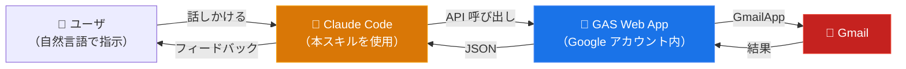

# ccskill-gmail

Claude Code に Gmail を操作させるためのスキルです。自然言語で指示するだけで、メールの確認・返信下書き・整理等ができます。API やコマンドを覚える必要はありません。

## 特徴

### メール操作

検索・閲覧・下書き作成・ラベル整理に加え、添付ファイルのダウンロードやメールの PDF 保存にも対応しています。一括操作（既読/未読、ラベル追加/削除、アーカイブ）にも対応しており、大量メールの効率的な処理が可能です。

### セキュリティポリシー

AIにメールを任せるリスクを鑑みて、安全寄りの設計を採用しています。

- **送信機能なし** — メール送信 API は実装していません。下書き作成まで。送信は人間が Gmail で確認してから行う想定です（Anthropic 公式の Claude.ai Gmail コネクタも同様の設計思想を採用しています）
- **削除はオプトイン** — メール削除はデフォルトで無効です（config.js で変更可能）
- **プロンプトインジェクション対策** — HTML メールに埋め込まれた隠し指示（CSS 非表示・ゼロ幅文字・白文字等）を無効化します
- **操作履歴の自動記録** — AI が行った全操作をローカルに記録します。メールの件名や本文は保存せず、アクション名と ID のみです

### 対応アカウント

Google アカウント、Google Workspace アカウントの両方に対応しています。複数アカウントの同時運用も可能です（プロジェクトディレクトリ単位で切り替え）。

## 使用例

### ワンショットの依頼

> 「未読メールを見せて」

> 「このメールに返信下書きを作って」

> 「重要なメールを確認して、対応済ラベルを付けて」

> 「今週届いた請求書メールを探して、添付PDFをダウンロードして」

> 「メールを既読にしてアーカイブして」

### 高度なワークフロー

複数メールの横断的な分析や、成果物の生成まで一言で任せられます。

**経理・管理**

> 「○○社からの領収書メールを直近半年分探して、添付PDFを `20260401_取引先名_税込金額_receipt.pdf` の形式で保存して」

> 「複数ベンダーから届いた見積もりメールを全て集めて、ベンダー名・品目・金額・納期の比較表を作って」

**引き継ぎ・ナレッジ**

> 「○○社の○○さんとのやり取りを全て遡り、経緯・残タスク・仕掛かりを含む引き継ぎ資料を作成して。一覧はExcelで」

> 「○○システムの障害対応メールを過去1年分調べて、発生日・原因・対処法の一覧を作って」

**対応漏れ検出・フォローアップ**

> 「過去1ヶ月で返信していない取引先メールを洗い出して、相手先・件名・放置日数の一覧を作って。重要なものにはフォローアップの下書きも作って」

**定期業務の自動化** — `/loop` コマンドと併用すると効果的です

> 「今週届いた社外メールを全件レビューして、要返信・FYI・対応完了に分類し、週次レポートにまとめて」

> 「メーリングリストや自動通知を全てリストアップして、送信元・頻度・最終受信日の一覧を作って。3ヶ月以上読んでないものはアーカイブして」

## 構造
ccskill-gmail では、GCP の Gmail API は使用していません。そのためセットアップが比較的簡単です。認証ユーザのみが使用できるブリッジAPIがGASプロジェクトとしてデプロイされ、これを Claude Code が使用する構造となっています。



## 必要なもの

- Google アカウント
- Node.js / npm
- jq（JSON 処理ツール）
- Bash (macOS, Linux, WSL)
- Apps Script API の有効化 — 初めて GAS を使う場合には https://script.google.com/home/usersettings で「Google Apps Script API」をオンにしてください

## セットアップ

### 1. スキルを入手

**git clone の場合:**

```bash
cd ~/projects
git clone https://github.com/feedtailor/ccskill-gmail.git
```

**zip 配布の場合:**

```bash
cd ~/projects
unzip ccskill-gmail-XXXXXX.zip
```

### 2. セットアップ

clasp のローカルインストール、PATH 登録、Google ログインを一括で行います。

```bash
cd ~/projects/ccskill-gmail
./ccskill-gmail setup
```

### 3. プロジェクトにインストール

```bash
cd /path/to/your-project
ccskill-gmail install
```

インストーラーが GAS プロジェクトの作成、デプロイ、Google 認可まで自動で行います。ブラウザが開いたら「許可」をクリックしてください。

**SSH / ヘッドレス環境:** インストーラーは認証 URL をターミナルに常時表示するため、別のマシンのブラウザにコピーして開くことも可能です。

## 更新

**git clone の場合:**

```bash
cd ~/projects/ccskill-gmail
git pull

# プロジェクトに反映
ccskill-gmail update        # 個別(プロジェクト配下で)
ccskill-gmail update-all    # 一括
```

**zip 配布の場合:**

新しい zip を展開して上書きした後、`ccskill-gmail update` でプロジェクトに反映してください。

## アンインストール

```bash
ccskill-gmail uninstall
```

ローカルファイル（`.ccskill-gmail/`、スキル定義、パーミッション設定）が削除されます。Google Apps Script のプロジェクトは自動削除されないため、完全に削除したい場合は [script.google.com](https://script.google.com) から手動で削除してください。

## その他のコマンド

```bash
ccskill-gmail status              # インストール状況の一覧表示
ccskill-gmail doctor              # 環境・セットアップの診断
ccskill-gmail history             # API 操作の監査ログ表示
ccskill-gmail apply-config        # config.js の変更を GAS に反映
ccskill-gmail register <PATH>     # 既存インストールの登録
ccskill-gmail release             # 配布用 zip ファイルの作成
ccskill-gmail help                # 全コマンドの表示
```

## トラブルシューティング

### install が途中で失敗した場合

`ccskill-gmail install` を再度実行してください。「Overwrite?」と聞かれるので `y` で上書きすれば最初からやり直せます。失敗時に GAS プロジェクトが Google 側に残ることがあります。[script.google.com](https://script.google.com) から手動で削除してから再実行してください。

### リダイレクトループ / 「ファイルを開くことができません」エラー

ブラウザに複数の Google アカウントでログインしている場合や、シークレットウィンドウに別アカウントのセッションが残っている場合に発生します。以下の手順で解決できます:

1. ターミナルに表示された **認証 URL** をコピーする（`https://script.google.com/macros/s/...` で始まる URL）
2. **新しいシークレットウィンドウ**を開く（既存のシークレットウィンドウがあれば閉じてセッションをクリアする）
3. [accounts.google.com](https://accounts.google.com) にアクセスし、このプロジェクトで使いたい Google アカウントで**明示的にログイン**する
4. **同じウィンドウで**、コピーした認証 URL をアドレスバーに貼り付けて開く
5. 「許可」をクリックして認可を完了する

**重要:**
- ブラウザのエラーページに表示される URL はコピーしないでください。リダイレクトデータが壊れています。必ずターミナルに表示されたクリーンな URL を使ってください
- 認証 URL を開く**前に** accounts.google.com でログインしてください。先に認証 URL を開くと同じリダイレクトループが発生します

### マルチアカウントの OAuth 問題

`--user` を使用して認証エラーが発生する場合は、プロジェクトディレクトリで `ccskill-gmail doctor` を実行してください。clasp のログイン状態、OAuth トークン、エンドポイント接続まで一通りチェックし、問題箇所と修正方法を提示します。

### update 後に正常動作しない場合

`ccskill-gmail doctor` で診断してください。問題が解決しない場合は `ccskill-gmail update --force` で GAS プロジェクトを再デプロイしてください。

## 技術詳細

### 権限について

セットアップ中、Google から権限の許可を求められます。

**clasp 関連の権限（セットアップ時）**

| 権限 | 用途 |
|---|---|
| Google Drive ファイルの参照・管理 | GAS プロジェクトファイルの作成・更新 |
| Apps Script プロジェクトの参照・管理 | GAS プロジェクトの作成・コード push |
| デプロイの参照・管理 | Web App のデプロイ |

clasp（GAS を CLI で扱うための Google 公式ツール）が要求する標準的な権限です。本スキルでは clasp を使用するために必要となります。

**Gmail の権限（初回利用時）**

| 権限（OAuth スコープ） | 用途 |
|---|---|
| `gmail.readonly` | メール検索・閲覧、ラベル一覧、添付ファイルのダウンロード |
| `gmail.compose` | 下書きの作成・編集 |
| `gmail.modify` | 既読/未読、ラベル追加/削除、アーカイブ、ゴミ箱移動 |

必要最小限のスコープのみ要求しています。`gmail.send` スコープは要求しません。

### 複数アカウントで使う場合

`--user` を指定しない場合はデフォルトアカウントが使われます。単一アカウントで使う場合は指定不要です。

プロジェクトごとに異なる Google アカウントを使い分けたい場合は、`--user` オプションを使います。Google ログインが必要な場合はインストーラーが自動で案内します。

```bash
cd /path/to/work-project
ccskill-gmail install --user work
# Google ログインが必要な場合は自動で案内されます
# 以降、このディレクトリでは work アカウントの Gmail が使われる
```

`--user` には英数字・ハイフン・アンダースコアのみ使用できます（例: `work`, `personal`, `info-ft`）。

### スキル定義ドキュメント

API の仕様やトラブルシューティングは、スキル定義ドキュメントを参照してください:

- [SKILL.md](.claude/skills/ccskill-gmail/SKILL.md) — API 仕様とルール
- [examples.md](.claude/skills/ccskill-gmail/examples.md) — ワークフロー例
- [troubleshooting.md](.claude/skills/ccskill-gmail/troubleshooting.md) — よくある問題と解決策

## 他のツールとの比較

Gmail を AI から操作する他のツールとの比較表を以下に示します。

| 機能 | ccskill-gmail | [Claude Gmail コネクタ](https://support.claude.com/ja/articles/10166901-google-workspace-%E3%82%B3%E3%83%8D%E3%82%AF%E3%82%BF%E3%82%92%E4%BD%BF%E7%94%A8%E3%81%99%E3%82%8B) | [Google Workspace CLI](https://github.com/googleworkspace/cli) | [gogcli](https://github.com/steipete/gogcli) |
|---|---|---|---|---|
| 送信 | x（下書きのみ） | x（下書きのみ） | o | o |
| 削除 | x（デフォルト無効） | x | o | o |
| 下書き作成 | o | o | o | o |
| 添付ダウンロード | o | x（メタデータのみ） | o | o |
| メールPDF保存 | o | x | x | x |
| 監査ログ | o（ローカル自動記録） | x | x | x |
| インジェクション対策 | o（GAS 側で実装） | x | x | x |

## 制限事項

- 送信機能なし（下書き作成のみ、送信は Gmail UI で手動）
- 添付ファイル: 5MB まで対応
- 下書きは常に HTML 形式（プレーンテキストへの返信でも同様。GmailApp の制約により、プレーンテキストでは改行が消失するため）

## ライセンス

MIT License
