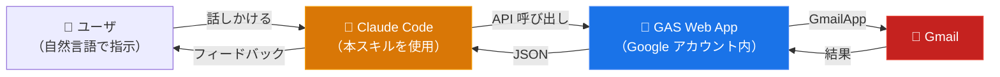

# ccskill-gmail

**Gmail での作業を、もっともっと楽にする。**

ccskill-gmail は、Claude Code 標準の Gmail コネクタ (MCP) を補完するスキルです。標準コネクタでは不可能な、添付ファイルのダウンロード・メール本文の PDF 化・プロンプトインジェクション対策のほか、Claude Code による操作ログの記録、複数 Gmail アカウントの使い分けにも対応しています。

日常的な検索・閲覧・返信下書き作成のみであれば、標準 Gmail コネクタの方が使いやすい可能性がありますが、本スキルにも同じ機能が備わっていますので標準スキルの代わりとして使用することもできます。

## 機能比較

| 機能 / タスク | 標準コネクタ | Workspace MCP (プレビュー) | ccskill-gmail |
|---|:---:|:---:|:---:|
| メールの検索と内容の確認 | ○ | ○ | ○ |
| メールの下書き作成 | ○ | ○ | ○ |
| ラベルの付与・削除 | × | ○ | ○ |
| ゴミ箱への移動 | × | × | ○ |
| アーカイブ | × | × | ○ |
| 未読・既読のトグル | × | × | ○ |
| スター付与 | × | × | ○ |
| 添付ファイルのダウンロード | × | × | ○ |
| メール本文の PDF 化 | × | × | ○ |
| プロンプトインジェクション対策（HTML メール中の隠しプロンプトの無効化） | × | × | ○ |
| メール操作の監査ログ | × | × | ○ |
| マルチアカウント対応 | × | × | ○ |
| Gmail 連携スクリプトの開発 | × | × | ○ |

出典: [Claude 公式ドキュメント「Google Workspace コネクタを使用する」](https://support.claude.com/en/articles/10166901-use-google-workspace-connectors) / [Google「Workspace MCP サーバーを構成する」](https://developers.google.com/workspace/guides/configure-mcp-servers?hl=ja)。Workspace MCP は執筆時点でプレビュー提供のため、内容は変わる可能性があります。

## 特徴的な機能

### 添付ファイルのダウンロード

添付ファイルをダウンロードできます。メール本文に応じたファイル名で保存したり、添付ファイルの内容を踏まえた作業を指示することができます。

### メール本文のPDFファイル化

メール本文をPDFファイルとして保存できます。HTMLメール・テキストメールの両方に対応しています。

### 複数アカウント対応

標準の Gmail コネクタは Claude に紐付いた一つのアカウントにしかアクセスできませんが、ccskill-gmail はプロジェクトディレクトリごとに任意の Gmail アカウントを個別に接続できます。

```bash
cd /path/to/work-project    # work@company.com を操作
cd /path/to/personal-blog   # you@gmail.com を操作
cd /path/to/client-x        # sales@client-x.example を操作
```

1つのプロジェクトディレクトリに紐づけられる Gmail アカウントは1つです。

### 操作履歴の記録と振り返り

ccskill-gmail が行った作業を振り返ることができます。

本スキルによるメール検索・内容取得・下書き作成・添付ダウンロード等の全ての操作をローカル監査ログ(JSONL形式)で保存することにより実現しています。

記録されるのは操作名とthread IDのみで、件名・本文・宛先等は記録しません。Claude Code に振り返りを指示した時に thread ID を頼りに情報を取得する設計になっています。

### Gmail を使う独自スクリプトの開発

本スキルが内蔵する `.ccskill-gmail/api` は Gmail 操作スクリプトとして機能します。このスクリプトを使って、Gmail と連携するプログラムを Claude Code に開発してもらうことができます。OAuthを前提とする GCP のAPIキーの発行は不要です。

### セキュリティ

- **送信機能はありません。** Claude Code が下書きを作成し、送信はユーザが Gmail から手動で行う設計です（標準コネクタも同じ思想）
- **ゴミ箱移動はデフォルト無効。** 必要な場合は `config.js` でオプトインしてください
- **プロンプトインジェクション対策。** HTML メールに埋め込まれた隠し指示（CSS 非表示・ゼロ幅文字・白文字等）は、GAS 層で無効化してから AI に渡します
- **Googleアカウント認証前提。** Google アカウントで認証することを前提とした作りになっています。

## 具体的な使用例

### 添付ファイルの領収書を整理

> 「○○社からの領収書メールを直近半年分探して、添付PDFを `20260401_取引先名_税込金額_receipt.pdf` の形式で保存して」

### 過去のメールやり取りの整理

> 「○○社の○○さんとのやり取りを全て遡り、経緯・残タスク・仕掛かりを含む引き継ぎ資料を作成して。一覧はExcelで」

> 「○○システムの障害対応メールを過去1年分調べて、発生日・原因・対処法の一覧を作って」

### 文脈をふまえた返信メール下書き

> 「過去1ヶ月で返信していない取引先メールを洗い出して、相手先・件名・放置日数の一覧を作って。重要なものにはフォローアップの下書きも作って」

### 作業の振り返り

> 「先週○○をお願いした件を時系列でまとめてください」

### 不要メールのアーカイブ

> 「メーリングリストや通知系メールを抽出して、送信元・頻度・最終受信日の一覧を作って。3ヶ月以上未読が放置されているメールはアーカイブして」

### 独自スクリプトの開発

> 「スパムらしきメールを検索して送信元ドメインを抽出するスクリプトを作って」

> 「今月届いた請求書メールから PDF 添付を一括ダウンロードするスクリプトを書いて」

> 「毎日の未読メールサマリーを Markdown で出力するスクリプトを生成して」

## 必要なもの・前提条件

- Google アカウント (個人用 / GoogleWorksspace)
- Node.js / npm
- jq
- Google Apps Script API の有効化 (初めて GAS を使う場合には [Google Apps Script API の設定](https://script.google.com/home/usersettings) をオンにする必要があります)

## インストール

### 1. スキルの入手

**git clone の場合:**

```bash
cd ~/projects
git clone https://github.com/feedtailor/ccskill-gmail.git
```

**zip 配布の場合:**

```bash
cd ~/projects
unzip ccskill-gmail-XXXXXX.zip
```

### 2. セットアップスクリプトの実行

clasp のインストール、PATH 登録、Google ログインを行います。

```bash
cd ~/projects/ccskill-gmail
./ccskill-gmail setup
```

### 3. プロジェクトにインストール

本スキルを使うプロジェクトのディレクトリでインストールコマンドを実行します。

```bash
cd /path/to/your-project
ccskill-gmail install
```

GAS プロジェクトの作成、デプロイを自動で行います。途中で Google の認証のためブラウザが開きますので「許可」してください。

### 4. 確認

インストール完了後、`ccskill-gmail info` を実行してください。以下のような情報が表示されますので、意図した通りにプロジェクトディレクトリと Gmail が連携していることを確認してください。

```bash
  Account:       ccskill-gmail@example.com
  Directory:     /path/to/your-project
  Version:       999ce0e
  Installed:     2026-05-06 01:23:45

  Permissions:
    Denied:      move_to_trash

  Inbox:         xxxx unread
  Starred:       xx unread
```

## 更新

ccskill-gmail は機能追加や不具合修正で更新されることがあります。

### git clone の場合

ccskill-gmail をインストールしたディレクトリで `git pull` を実行したのち、アップデートコマンドを実行してください。ccskill-gmail がインストールされたプロジェクトディレクトリを検出し全てのプロジェクトにアップデートをかけます。

```bash
cd ~/projects/ccskill-gmail
git pull
ccskill-gmail update-all
```

個別にプロジェクト単位でアップデートすることもできます。

```bash
cd /path/to/your-project/
ccskill-gmail update
```

### zip 配布の場合

新しい zip をダウンロードし、プロジェクトディレクトリに展開した後、`ccskill-gmail update` で反映してください。

## アンインストール

```bash
ccskill-gmail uninstall
```

ローカルファイル（`.ccskill-gmail/`、スキル定義、パーミッション設定）が削除されます。Google Apps Script のプロジェクトは自動削除されないため、[script.google.com](https://script.google.com) から手動で削除してください。

## その他のコマンド

```bash
ccskill-gmail help                # 全コマンドの表示
ccskill-gmail info [--json]       # 現在のプロジェクトの詳細表示（アカウント、権限、未読数）
ccskill-gmail status [--refresh]  # インストール状況の一覧表示
ccskill-gmail doctor              # 環境・セットアップの診断
ccskill-gmail history             # API 操作の監査ログ表示
ccskill-gmail apply-config        # config.js の変更を GAS に反映
ccskill-gmail register <PATH>     # 既存インストールの登録
ccskill-gmail release             # 配布用 zip ファイルの作成
```

## 複数アカウント利用

Google アカウントを使い分けたい場合は `--user` オプションを使います。`--user` には英数字・ハイフン・アンダースコアのみ使用できます。（例: `work`, `personal2`, `info-ft`）

```bash
cd /path/to/work-project
ccskill-gmail install --user work
```

途中、Google ログインが別途必要な場合があります。プロジェクトディレクトリに Google アカウントが紐づきます。

## 技術情報

### 構造

ccskill-gmail は、GCP の Gmail API を使用しません。その代わり、認証ユーザのみが使用できるブリッジ API を GAS プロジェクトとしてデプロイします。これを Claude Code が使用する構造となっています。



Google アカウントはプロジェクトディレクトリに紐づくため、操作する Gmail をプロジェクトごとに変えることができます。


### 権限について

セットアップ中、Google から権限の許可を求められます。

**clasp 関連の権限（セットアップ時）**

| 権限 | 用途 |
|---|---|
| Google Drive ファイルの参照・管理 | GAS プロジェクトファイルの作成・更新 |
| Apps Script プロジェクトの参照・管理 | GAS プロジェクトの作成・コード push |
| デプロイの参照・管理 | Web App のデプロイ |

clasp（GAS を CLI で扱うための Google 公式ツール）が要求する標準的な権限です。本スキルでは clasp を使用するために必要となります。

**Gmail の権限（初回利用時）**

| 権限（OAuth スコープ） | 用途 |
|---|---|
| `gmail.readonly` | メール検索・閲覧、ラベル一覧、添付ファイルのダウンロード |
| `gmail.compose` | 下書きの作成・編集 |
| `gmail.modify` | 既読/未読、ラベル追加/削除、アーカイブ、ゴミ箱移動 |

必要最小限のスコープのみ要求しています。`gmail.send` スコープは要求しません。

### スキル定義ドキュメント

API の仕様やトラブルシューティングは、スキル定義ドキュメントを参照してください:

- [SKILL.md](.claude/skills/ccskill-gmail/SKILL.md) — API 仕様とルール
- [examples.md](.claude/skills/ccskill-gmail/examples.md) — ワークフロー例
- [troubleshooting.md](.claude/skills/ccskill-gmail/troubleshooting.md) — よくある問題と解決策

## トラブルシューティング

### install が途中で失敗した場合

`ccskill-gmail install` を再度実行してください。「Overwrite?」と聞かれるので `y` で上書きすれば最初からやり直せます。失敗時に GAS プロジェクトが Google 側に残ることがあります。[script.google.com](https://script.google.com) から手動で削除してから再実行してください。

### ブラウザが開いた時にリダイレクトループエラーや、「ファイルを開くことができません」のエラーが表示される

既にブラウザで複数 Google アカウントでログインしていたり、別アカウントのセッションが残っている場合に発生します。以下の手順を試して下さい。

1. ターミナルに表示された **認証 URL** をコピーする（`https://script.google.com/macros/s/...` で始まる URL）
2. **新しいシークレットウィンドウ**を開く（既存のシークレットウィンドウがあれば全て閉じる）
3. [accounts.google.com](https://accounts.google.com) にアクセスして紐づけたい Gmail の Google アカウントでログインする
4. 同じウィンドウで、1.でコピーした認証 URL をアドレスバーに貼り付けて開く
5. 「許可」をクリックする

**重要:**
- ブラウザのエラーページに表示される URL はコピーしないでください。必ず**ターミナルに表示されたURL**を使ってください
- コピーした認証URLを開く**前に**、accounts.google.com でログインしてください。先に認証URLを開くと同じリダイレクトループが発生します

### マルチアカウントのOAuth認証エラー

`--user` を使用して認証エラーが発生する場合は、プロジェクトディレクトリで `ccskill-gmail doctor` を実行してください。clasp のログイン状態、OAuth トークン、エンドポイント接続まで一通りチェックし、問題箇所と修正方法を提示します。

### update 後に正常動作しない場合

`ccskill-gmail doctor` で診断してください。問題が解決しない場合は `ccskill-gmail update --force` で GAS プロジェクトを再デプロイしてください。

## サポート

サポートは一切行っていません。ご質問等を頂いてもご回答は致しません。無償で公開しているものですのでご了承下さい。法人や業務用途等でサポートが必要な場合、[こちら](https://www.feedtailor.jp/product_advisory-claudecode/)をご契約下さい。

## ライセンス

MIT License
