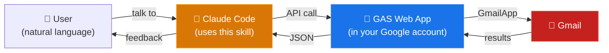

# ccskill-gmail

A Claude Code skill for Gmail. Just tell Claude what you want in natural language — search, read, draft replies, organize emails, and more.

[日本語版 README はこちら](README.ja.md)

## Features

### Email Operations

Search, read, draft, label management, attachment download, and email-to-PDF export.

### Security Policy

Designed with safety in mind for AI-driven email operations:

- **No send capability** — No send API is implemented. Only draft creation. Users review and send manually from Gmail (this is the same approach as Anthropic's official Claude.ai Gmail connector)
- **Delete is opt-in** — Email deletion is disabled by default (configurable in config.js)
- **Prompt injection protection** — Hidden instructions embedded in HTML emails (CSS hiding, zero-width characters, white-on-white text, etc.) are neutralized on the GAS side
- **Automatic audit logging** — All AI operations are logged locally. Only action names and IDs are recorded — no email subjects or body content

### Account Support

Works with both personal Google accounts and Google Workspace accounts. Multi-account usage is supported — each project directory can use a different account, and switching happens automatically by `cd`.

## Examples

### One-shot Requests

> "Show me unread emails"

> "Draft a reply to this email"

> "Check important emails and add the 'handled' label"

> "Find invoice emails from this week and download the attached PDFs"

> "Mark these emails as read and archive them"

### Advanced Workflows

Describe a complex, multi-step workflow in plain language and let Claude handle the rest.

**Accounting & Administration**

> "Find all receipt emails from ACME Corp in the last 6 months and save the attached PDFs as `20260401_VendorName_TotalWithTax_receipt.pdf`"

> "Collect all quote emails from multiple vendors and create a comparison table with vendor name, item, price, and delivery date"

**Handover & Knowledge Base**

> "Trace the entire email history with John at ACME Corp and create a handover document including background, open tasks, and work in progress. Export the list as Excel"

> "Search all incident response emails for the XYZ system from the past year and create a table of occurrence date, root cause, and resolution"

**Missed Response Detection & Follow-up**

> "Find all external emails from the past month that I haven't replied to. List them with sender, subject, and days since received. Draft follow-up replies for the important ones"

**Recurring Task Automation** — works great with the `/loop` command

> "Review all external emails received this week, categorize them as needs-reply / FYI / resolved, and compile a weekly report"

> "List all mailing lists and automated notifications by sender, frequency, and last received date. Archive any I haven't read in over 3 months"

## Architecture

Instead of using the GCP Gmail API, this skill deploys a bridge API as a GAS (Google Apps Script) project accessible only to the authenticated user. Claude Code calls this as a private Gmail API.



## Requirements

- Google account
- clasp
- jq

## Installation

### As a Claude Code Plugin

```bash
# Add the feedtailor ccskill marketplace
/plugin marketplace add feedtailor/ccskill

# Install the Gmail skill
/plugin install ccskill-gmail@ccskill
```

### Manual Installation

#### 1. Get the skill

```bash
cd ~/projects
git clone https://github.com/feedtailor/ccskill-gmail.git
```

#### 2. Add to PATH

Add to `~/.zshrc` or `~/.bashrc`:

```bash
export PATH="$HOME/projects/ccskill-gmail:$PATH"
```

Then reload:

```bash
source ~/.zshrc  # or source ~/.bashrc
```

#### 3. Install and login to clasp

[clasp](https://github.com/nicholaschiang/clasp) is a CLI tool for managing Google Apps Script. This skill uses it for GAS project creation, deployment, and OAuth authorization.

```bash
npm install -g @google/clasp
clasp login
```

#### 4. Install to your project

```bash
cd /path/to/your-project
ccskill-gmail install
```

The installer will automatically create a GAS project, deploy it, and handle OAuth authorization. When a browser window opens, click "Allow".

#### Multi-account Setup

Without `--user`, the default account from `clasp login` is used. No additional setup is needed for single-account usage.

To use different Google accounts for different projects, use the `--user` option. Switching happens automatically when you `cd` into the project directory.

```bash
# 1. Login with another account
clasp --user work login

# 2. Install with that account
cd /path/to/work-project
ccskill-gmail install --user work

# This directory now uses the work account's Gmail
```

## Update

```bash
cd ~/projects/ccskill-gmail
git pull

# Apply to projects
ccskill-gmail update        # single project
ccskill-gmail update-all    # all projects
```

## Uninstall

```bash
ccskill-gmail uninstall
```

This removes local files (`.ccskill-gmail/`, skill definitions, permission settings). The Google Apps Script project is not automatically deleted — to fully remove it, delete it manually from [script.google.com](https://script.google.com).

## Other Commands

Run `ccskill-gmail help` to see all available commands.

## Using with Codex CLI

Codex CLI does not support Claude Code plugins, but you can use the skill definition directly:

```bash
# Copy the skill definition to Codex's skill directory
mkdir -p .agents/skills/ccskill-gmail
cp .claude/skills/ccskill-gmail/SKILL.md .agents/skills/ccskill-gmail/SKILL.md
```

Note: The GAS Web App setup (`ccskill-gmail install`) is still required.

## Technical Details

For API specifications and troubleshooting, see the skill definition documents:

- [SKILL.md](.claude/skills/ccskill-gmail/SKILL.md) — API specification and rules
- [examples.md](.claude/skills/ccskill-gmail/examples.md) — Workflow examples
- [troubleshooting.md](.claude/skills/ccskill-gmail/troubleshooting.md) — Common issues and solutions

## Comparison with Other Tools

Several tools exist for AI-driven Gmail access.

| Feature | ccskill-gmail | [Claude Gmail Connector](https://support.claude.com/en/articles/10166901-use-google-workspace-connectors) | [Google Workspace CLI](https://github.com/googleworkspace/cli) | [gogcli](https://github.com/steipete/gogcli) |
|---|---|---|---|---|
| Send | x (draft only) | x (draft only) | o | o |
| Delete | x (disabled by default) | x | o | o |
| Draft creation | o | o | o | o |
| Attachment download | o | x (metadata only) | o | o |
| Email PDF export | o | x | x | x |
| Audit log | o (automatic local log) | x | x | x |
| Injection protection | o (implemented in GAS) | x | x | x |

## Limitations

- No send capability (draft creation only; send manually from Gmail UI)
- GAS execution time limits: 6 min/execution, 90 min/day
- Attachments: up to 5 MB

## License

MIT License — see [LICENSE](LICENSE) for details.
