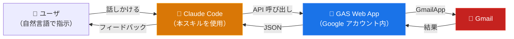

# ccskill-gmail

Claude Code に Gmail を操作させるためのスキルです。自然言語で指示するだけで、メールの確認・返信下書き・整理等ができます。API やコマンドを覚える必要はありません。

```
「未読メールを見せて」
「このメールに返信下書きを作って」
「重要なメールを確認して、対応済ラベルを付けて」
「今週届いた請求書メールを探して、添付PDFをダウンロードして」
「メールを既読にしてアーカイブして」
```

## 特徴

### メール操作

検索・閲覧・下書き作成・ラベル整理に加え、添付ファイルのダウンロードやメールの PDF 保存にも対応しています。

### セキュリティポリシー

AIにメールを任せるリスクを鑑みて、安全寄りの設計を採用しています。

- **送信機能なし** — メール送信 API は実装していません。下書き作成まで。送信は人間が Gmail で確認してから行う想定です（Anthropic 公式の Claude.ai Gmail コネクタも同様の設計思想を採用しています）
- **削除はオプトイン** — メール削除はデフォルトで無効です（config.js で変更可能）
- **プロンプトインジェクション対策** — HTML メールに埋め込まれた隠し指示（CSS 非表示・ゼロ幅文字・白文字等）を GAS 側で無効化しています
- **操作履歴の自動記録** — AI が行った全操作をローカルに記録。メールの件名や本文は保存せず、アクション名と ID のみです

### 対応アカウント

Google アカウント、Google Workspace アカウントの両方に対応しています。

## 構造
GCP の Gmail API は使用せず、認証ユーザのみが使用できるブリッジAPIをGASプロジェクトとしてデプロイします。Claude Code は認証済みユーザ専用の Gmail API として機能します。



## 必要なもの

- Google アカウント
- Node.js / npm
- jq（`brew install jq`）
- Bash 環境（macOS, Linux, WSL）

## セットアップ

### 1. スキルを入手

**git clone の場合:**

```bash
cd ~/projects
git clone https://github.com/feedtailor/ccskill-gmail.git
```

**zip 配布の場合:**

```bash
cd ~/projects
unzip ccskill-gmail-XXXXXX.zip
```

### 2. セットアップ

clasp のローカルインストール、PATH への登録、Google ログインを一括で行います。

```bash
cd ~/projects/ccskill-gmail
./ccskill-gmail setup
```

### 3. プロジェクトにインストール

```bash
cd /path/to/your-project
ccskill-gmail install
```

インストーラーが GAS プロジェクトの作成、デプロイ、OAuth 認可まで自動で行います。ブラウザが開いたら「許可」をクリックしてください。

## 更新

**git clone の場合:**

```bash
cd ~/projects/ccskill-gmail
git pull

# プロジェクトに反映
ccskill-gmail update        # 個別
ccskill-gmail update-all    # 一括
```

**zip 配布の場合:**

新しい zip を展開して上書きした後、`ccskill-gmail update` でプロジェクトに反映してください。

## アンインストール

```bash
ccskill-gmail uninstall
```

ローカルファイル（`.ccskill-gmail/`、スキル定義、パーミッション設定）が削除されます。Google Apps Script のプロジェクトは自動削除されないため、完全に削除したい場合は [script.google.com](https://script.google.com) から手動で削除してください。

## その他のコマンド

`ccskill-gmail help` で全コマンドを確認できます。

## 技術詳細

API の仕様やトラブルシューティングは、スキル定義ドキュメントを参照してください:

- [SKILL.md](.claude/skills/ccskill-gmail/SKILL.md) — API 仕様とルール
- [examples.md](.claude/skills/ccskill-gmail/examples.md) — ワークフロー例
- [troubleshooting.md](.claude/skills/ccskill-gmail/troubleshooting.md) — よくある問題と解決策

## 他のツールとの比較

Gmail を AI から操作するツールは複数存在します。

| 機能 | ccskill-gmail | [Claude Gmail コネクタ](https://support.claude.com/ja/articles/10166901-google-workspace-%E3%82%B3%E3%83%8D%E3%82%AF%E3%82%BF%E3%82%92%E4%BD%BF%E7%94%A8%E3%81%99%E3%82%8B) | [Google Workspace CLI](https://github.com/googleworkspace/cli) | [gogcli](https://github.com/steipete/gogcli) |
|---|---|---|---|---|
| 送信 | x（下書きのみ） | x（下書きのみ） | o | o |
| 削除 | x（デフォルト無効） | x | o | o |
| 下書き作成 | o | o | o | o |
| 添付ダウンロード | o | x（メタデータのみ） | o | o |
| メールPDF保存 | o | x | x | x |
| 監査ログ | o（ローカル自動記録） | x | x | x |
| インジェクション対策 | o（GAS 側で実装） | x | x | x |

## 制限事項

- 送信機能なし（下書き作成のみ、送信は Gmail UI で手動）
- GAS 実行時間制限: 6分/実行、90分/日
- 添付ファイル: 5MB まで対応

## ライセンス

MIT License
