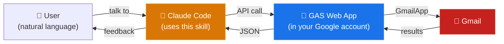

# ccskill-gmail

**Make Gmail work a whole lot easier.**

ccskill-gmail is a skill that complements Claude Code's built-in Gmail connector (MCP). It adds what the standard connector can't do — attachment downloads, mail-body PDF export, prompt-injection defenses — plus local audit logging of every Claude Code action and support for multiple Gmail accounts.

For everyday search, reading, and reply drafting alone, the standard Gmail connector may feel more natural to use — but ccskill-gmail covers those cases too.

[日本語版 README はこちら](README.ja.md)

## Feature comparison

| Capability / task | Gmail Connector | Workspace MCP (preview) | ccskill-gmail |
|---|:---:|:---:|:---:|
| Search and read mail | ○ | ○ | ○ |
| Draft creation | ○ | ○ | ○ |
| Label add / remove | × | ○ | ○ |
| Move to trash | × | × | ○ |
| Archive | × | × | ○ |
| Toggle read / unread | × | × | ○ |
| Add star | × | × | ○ |
| Attachment download (invoice PDFs, etc.) | × | × | ○ |
| Export mail body to PDF | × | × | ○ |
| Prompt-injection defenses (neutralizes hidden prompts in HTML mail) | × | × | ○ |
| Local audit log of every operation | × | × | ○ |
| Multi-account support | × | × | ○ |
| Build custom Gmail scripts | × | × | ○ |

Sources: [Claude official docs — "Use Google Workspace Connectors"](https://support.claude.com/en/articles/10166901-use-google-workspace-connectors) / [Google — "Configure Workspace MCP servers"](https://developers.google.com/workspace/guides/configure-mcp-servers)

## Distinctive features

### Attachment downloads

ccskill-gmail can download attachment file contents. You can have them saved with names derived from the email body, or hand them off as input for Claude Code's next step.

### Save mail body as PDF

You can save a mail body as a PDF file. Both HTML mail and plain-text mail are supported.

### Multi-account support

The standard Gmail connector only sees the single account linked to Claude. ccskill-gmail registers any number of Gmail accounts centrally, with a default account and per-request switching:

```bash
ccskill-gmail account add --label work      # register accounts (one-time each)
ccskill-gmail account add --label personal

ccskill-gmail api get action=get_profile                     # default account
ccskill-gmail api --account personal get action=get_profile  # switch per request
```

In Claude Code you can simply say things like "check this on my personal account". You can also pin a directory to a specific account so everything run there uses it:

```bash
cd /path/to/work-project
ccskill-gmail bind work     # this directory always operates on the work account
```

### Operation history

You can look back at the work ccskill-gmail has done.

This is implemented by writing every operation — mail search, content fetch, draft creation, attachment download, and so on — to a local audit log in JSONL.

Only the action name and Gmail thread ID are recorded; subjects, bodies, and recipients are not. When you ask Claude Code to display  history, the information is looked up using those thread IDs.

### Build your own Gmail scripts

The `ccskill-gmail api` command works as a Gmail operation script callable from anywhere. You can use it to have Claude Code build programs that integrate with Gmail. No GCP API key (and no OAuth setup) is required.

### Security

- **No send feature.** Claude Code prepares the draft; you send it yourself from Gmail (same design as the standard connector)
- **Move-to-trash is off by default.** Opt in via `config.js` if you really need it
- **Prompt-injection defenses.** Hidden instructions embedded in HTML mail (CSS hiding, zero-width characters, white-on-white text, and so on) are neutralized in the GAS layer before they ever reach the AI
- **Built on Google account authentication.** The skill is designed around being authenticated with a Google account.

## Specific examples

### Organize attached receipts

> "Find all receipt emails from ACME Corp in the last 6 months and save the attached PDFs as `20260401_VendorName_TotalWithTax_receipt.pdf`"

### Make sense of past mail threads

> "Trace the entire email history with John at ACME Corp and create a handover document including background, open tasks, and work in progress. Export the list as Excel"

> "Search all incident response emails for the XYZ system from the past year and create a table of occurrence date, root cause, and resolution"

### Context-aware reply drafts

> "Find all external emails from the past month I haven't replied to. List them with sender, subject, and days since received. Draft follow-up replies for the important ones"

### Look back at recent work

> "Show me what I asked the skill last week, in order"

### Archive what you don't need

> "List all mailing lists and automated notifications by sender, frequency, and last received date. Archive any that have sat unread for more than 3 months"

### Build your own scripts

> "Write a script that searches likely-spam mails and extracts sender domains"

> "Write a script to bulk-download PDF attachments from this month's invoice mails"

> "Generate a daily unread-mail summary as Markdown"

## Requirements

- Google account (personal or Google Workspace)
- Node.js / npm
- jq
- Google Apps Script API enabled — first-time GAS users must turn on [the Google Apps Script API setting](https://script.google.com/home/usersettings)

## Installation

### 1. Get the skill

**git clone:**

```bash
cd ~/projects
git clone https://github.com/feedtailor/ccskill-gmail.git
```

**zip distribution:**

```bash
cd ~/projects
unzip ccskill-gmail-XXXXXX.zip
```

### 2. Run the setup script

Installs clasp, registers PATH, and handles Google login.

```bash
cd ~/projects/ccskill-gmail
./ccskill-gmail setup
```

### 3. Register your Gmail account

Register the Gmail account you want to use (one-time per account). GAS project creation and deployment happen automatically. A browser will open partway through for Google authorization — click "Allow".

```bash
ccskill-gmail account add
```

### 4. Register the skill for all projects

```bash
ccskill-gmail skill install
```

This registers ccskill-gmail as a Claude Code **user skill** (`~/.claude/skills/`), so every project on this machine can use Gmail through Claude Code — no per-project installation needed.

### 5. Verify

```bash
ccskill-gmail api whoami
ccskill-gmail api get action=get_profile
```

`whoami` shows which account a call from the current directory resolves to (and why). `get_profile` returns the account email and unread counts.

### (Optional) Per-project setup

If you want a specific project directory to always use a specific account, or you prefer fewer Claude Code permission prompts in a project, run `install` there:

```bash
cd /path/to/your-project
ccskill-gmail install              # bind to the default account + project files + permissions
ccskill-gmail install --account work   # or bind to a specific registered account
```

This does **not** create a new GAS project — it just pins the directory to a registered account (plus copies the skill files and offers permission settings). To create a dedicated per-project GAS deployment (advanced; e.g. per-project `config.js` permissions), use `ccskill-gmail install --dedicated`.

## Update

ccskill-gmail receives feature additions and bug fixes from time to time.

### git clone

In the directory where you cloned ccskill-gmail, run `git pull` and then the update-all command. It updates the account-level shared GAS deployments **and** every project where ccskill-gmail is installed.

```bash
cd ~/projects/ccskill-gmail
git pull
ccskill-gmail update-all
```

(If you registered the skill with `ccskill-gmail skill install`, the user skill is a symlink to this repository — it is up to date the moment you `git pull`.)

You can also update one account's shared GAS or one project at a time.

```bash
ccskill-gmail account update          # shared GAS for all registered accounts
cd /path/to/your-project/
ccskill-gmail update                  # one project
```

### zip distribution

Download the new zip, extract it over the project directory, then apply with `ccskill-gmail update`.

## Uninstall

```bash
ccskill-gmail uninstall          # remove a project installation
ccskill-gmail skill uninstall    # remove the user skill registration
ccskill-gmail account remove <email|label>   # remove an account from the registry
```

`uninstall` removes local project files (`.ccskill-gmail/`, skill definitions, permission settings). Google Apps Script projects are **not** automatically deleted — remove them manually from [script.google.com](https://script.google.com) if you want them gone.

## Other commands

```bash
ccskill-gmail help                # Show all commands
ccskill-gmail api whoami          # Show which account the current directory resolves to
ccskill-gmail account list        # Show registered accounts
ccskill-gmail account default <email|label>  # Change the default account
ccskill-gmail bind <email|label>  # Pin the current directory to an account
ccskill-gmail unbind [--purge-legacy]  # Remove the pin (and optionally legacy install files)
ccskill-gmail migrate             # Migrate pre-central installs to the account registry
ccskill-gmail info [--json]       # Show details for the current project (account, permissions, unread)
ccskill-gmail status [--refresh]  # List all installations and their status
ccskill-gmail doctor              # Diagnose environment and setup issues
ccskill-gmail history [--all]     # Show the API operation audit log
ccskill-gmail apply-config        # Push config.js changes to GAS (dedicated installs)
ccskill-gmail register <PATH>     # Register an existing installation
ccskill-gmail release             # Create a distributable zip file
```

## Using multiple accounts

Register each account once with a label (alphanumeric, hyphens, underscores — e.g. `work`, `personal2`, `info-ft`). A separate Google login happens per account.

```bash
ccskill-gmail account add --label work
ccskill-gmail account add --label personal
ccskill-gmail account list                  # * marks the default
ccskill-gmail account default personal     # change the default
```

Three ways to choose the account per call (highest priority first):

1. **Explicit**: `ccskill-gmail api --account work get ...` — in Claude Code, just name the account in your request
2. **Directory pin**: `ccskill-gmail bind work` — everything run in that directory uses the work account
3. **Default**: everything else uses the default account

`ccskill-gmail api whoami` always tells you which account a call would use and why.

## Technical details

### Architecture

ccskill-gmail does not use the GCP Gmail API. Instead, it deploys a bridge API as a GAS (Google Apps Script) project accessible only to the authenticated user, and Claude Code calls that bridge.



One GAS Web App is deployed per registered Google account (and shared by all directories), with the account chosen per call: explicit `--account` > directory pin (`bind`) > default account. Access to each Web App is restricted to the deploying Google account itself (MYSELF).

### Permissions

During setup, Google will ask you to grant permissions.

**clasp permissions (during setup)**

| Permission | What it's for |
|---|---|
| View and manage Google Drive files | Create and update GAS project files |
| View and manage Apps Script projects | Create the GAS project and push code |
| View and manage deployments | Deploy the Web App |

These are the standard permissions clasp (Google's official CLI for GAS) requests. ccskill-gmail relies on clasp, so they are required.

**Gmail permissions (on first use)**

| Permission (OAuth scope) | What it's for |
|---|---|
| `gmail.readonly` | Search and read mail, list labels, download attachments |
| `gmail.compose` | Create and edit drafts |
| `gmail.modify` | Toggle read/unread, add/remove labels, archive, move to trash |

Only the minimum scopes required are requested. The `gmail.send` scope is **not** requested.

### Skill definition documents

For API specifications and troubleshooting, see the skill definition documents:

- [SKILL.md](.claude/skills/ccskill-gmail/SKILL.md) — API specification and rules
- [examples.md](.claude/skills/ccskill-gmail/examples.md) — Workflow examples
- [troubleshooting.md](.claude/skills/ccskill-gmail/troubleshooting.md) — Common issues and solutions

## Troubleshooting

### Account registration fails midway

Re-run `ccskill-gmail account add`. A failed registration can leave a stranded GAS project on Google's side; remove it manually from [script.google.com](https://script.google.com) before retrying.

### Redirect loop or "Unable to open file" when the browser opens

This happens when you're already signed in to multiple Google accounts in the browser, or a session from a different account is still cached. Try the following:

1. Copy the **Authorization URL** shown in your terminal (starts with `https://script.google.com/macros/s/...`)
2. Open a **new private/incognito window** (close any existing private windows first)
3. Go to [accounts.google.com](https://accounts.google.com) and sign in with the Google account you want to bind
4. In the same window, paste the Authorization URL from step 1 into the address bar
5. Click "Allow"

**Important:**
- Do **not** copy the URL from the browser's error page — always use the URL **shown in your terminal**
- Sign in at accounts.google.com **before** opening the Authorization URL. Opening the URL first will trigger the same redirect loop

### Multi-account OAuth errors

If you encounter authentication errors with multiple accounts, run `ccskill-gmail doctor`. The doctor command checks the full chain — clasp login, OAuth tokens, the account registry, endpoint connectivity — and tells you exactly what's broken with fix suggestions.

### Something doesn't work after update

Run `ccskill-gmail doctor` to diagnose. If the issue persists, try `ccskill-gmail update --force` to redeploy the GAS project from scratch.

## Support

No support is provided — questions will not be answered. This is offered free of charge, so please understand. If you need support for commercial use, please consider a contract via [this page](https://www.feedtailor.jp/product_advisory-claudecode/).

## License

MIT License
