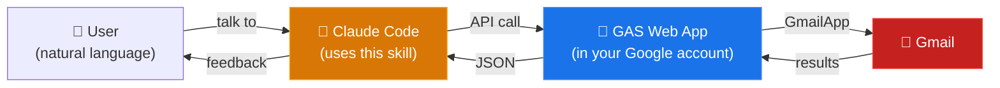

# ccskill-gmail

A Claude Code skill for Gmail. Just tell Claude what you want in natural language — search, read, draft replies, organize emails, and more.

[日本語版 README はこちら](README.ja.md)

## Features

### Email Operations

Search, read, draft, label management, attachment download, and email-to-PDF export. Bulk operations (mark read/unread, add/remove labels, archive) are also supported for efficient batch processing.

### Security Policy

Designed with safety in mind for AI-driven email operations:

- **No send capability** — No send API is implemented. Only draft creation. Users review and send manually from Gmail (this is the same approach as Anthropic's official Claude.ai Gmail connector)
- **Delete is opt-in** — Email deletion is disabled by default (configurable in config.js)
- **Prompt injection protection** — Hidden instructions embedded in HTML emails (CSS hiding, zero-width characters, white-on-white text, etc.) are neutralized
- **Automatic audit logging** — All AI operations are logged locally. Only action names and IDs are recorded — no email subjects or body content

### Account Support

Works with both personal Google accounts and Google Workspace accounts. Multi-account usage is supported — each project directory can use a different account, and switching happens automatically by `cd`.

## Examples

### One-shot Requests

> "Show me unread emails"

> "Draft a reply to this email"

> "Check important emails and add the 'handled' label"

> "Find invoice emails from this week and download the attached PDFs"

> "Mark these emails as read and archive them"

### Advanced Workflows

Describe a complex, multi-step workflow in plain language and let Claude handle the rest.

**Accounting & Administration**

> "Find all receipt emails from ACME Corp in the last 6 months and save the attached PDFs as `20260401_VendorName_TotalWithTax_receipt.pdf`"

> "Collect all quote emails from multiple vendors and create a comparison table with vendor name, item, price, and delivery date"

**Handover & Knowledge Base**

> "Trace the entire email history with John at ACME Corp and create a handover document including background, open tasks, and work in progress. Export the list as Excel"

> "Search all incident response emails for the XYZ system from the past year and create a table of occurrence date, root cause, and resolution"

**Missed Response Detection & Follow-up**

> "Find all external emails from the past month that I haven't replied to. List them with sender, subject, and days since received. Draft follow-up replies for the important ones"

**Recurring Task Automation** — works great with the `/loop` command

> "Review all external emails received this week, categorize them as needs-reply / FYI / resolved, and compile a weekly report"

> "List all mailing lists and automated notifications by sender, frequency, and last received date. Archive any I haven't read in over 3 months"

**Shell Script Generation** — automate Gmail beyond interactive sessions

The `.ccskill-gmail/api` command doubles as a Gmail bridge API callable from shell scripts. Just describe what you want automated, and Claude Code generates a working script — no manual API research needed.

> "Create a script that searches spam emails and extracts sender domains into NDJSON"

> "Write a script to download all PDF attachments from invoice emails this month"

> "Generate a daily unread email summary report in Markdown"

## Architecture

Instead of using the GCP Gmail API, this skill deploys a bridge API as a GAS (Google Apps Script) project accessible only to the authenticated user. Claude Code calls this as a private Gmail API.



## Requirements

- Google account
- Node.js / npm
- jq (command-line JSON processor)
- Bash (macOS, Linux, WSL)
- Apps Script API enabled — visit https://script.google.com/home/usersettings and turn on "Google Apps Script API" (required for first-time GAS users)

## Installation

### 1. Get the skill

```bash
cd ~/projects
git clone https://github.com/feedtailor/ccskill-gmail.git
```

### 2. Setup

Installs clasp locally, registers PATH, and handles Google login in one command.

```bash
cd ~/projects/ccskill-gmail
./ccskill-gmail setup
```

### 3. Install to your project

```bash
cd /path/to/your-project
ccskill-gmail install
```

The installer will automatically create a GAS project, deploy it, and handle Google authorization. When a browser window opens, click "Allow".

**SSH / headless environments:** The installer always displays the Authorization URL in the terminal, so you can copy it and open it in any browser — even on a different machine.

## Update

```bash
cd ~/projects/ccskill-gmail
git pull

# Apply to projects
ccskill-gmail update        # single project
ccskill-gmail update-all    # all projects
```

## Uninstall

```bash
ccskill-gmail uninstall
```

This removes local files (`.ccskill-gmail/`, skill definitions, permission settings). The Google Apps Script project is not automatically deleted — to fully remove it, delete it manually from [script.google.com](https://script.google.com).

## Other Commands

```bash
ccskill-gmail status              # Show all installations and their health
ccskill-gmail doctor              # Diagnose environment and setup issues
ccskill-gmail history             # Show API operation audit log
ccskill-gmail apply-config        # Push config.js changes to GAS
ccskill-gmail register <PATH>     # Register an existing installation
ccskill-gmail release             # Create a distributable zip file
ccskill-gmail help                # Show all available commands
```

## Troubleshooting

### Installation fails midway

Re-run `ccskill-gmail install`. You'll be asked "Overwrite?" — answer `y` to overwrite the previous partial installation. A failed install may also leave an orphaned GAS project on Google's side — delete it manually from [script.google.com](https://script.google.com) before retrying.

### Redirect loop or "Unable to open file" during Google authorization

This happens when your browser is logged into multiple Google accounts, or when a private window has a cached session from a different account. Follow these steps:

1. Copy the **Authorization URL** shown in your terminal (starts with `https://script.google.com/macros/s/...`)
2. Open a **new private/incognito window** (close any existing private windows to clear cached sessions)
3. Go to [accounts.google.com](https://accounts.google.com) and **explicitly sign in** with the Google account you want to use for this project
4. In the **same window**, paste the Authorization URL into the address bar
5. Click "Allow" to authorize the script

**Important:**
- Do NOT copy the URL from the browser's error page — it contains corrupted redirect data. Always use the clean URL from your terminal
- Make sure to sign in at accounts.google.com **before** opening the Authorization URL — opening the URL first may trigger the same redirect loop

### Multi-account OAuth issues

If you use `--user` and encounter authentication errors, run `ccskill-gmail doctor` in the project directory. The doctor command checks the full chain — clasp login, OAuth tokens, endpoint connectivity — and tells you exactly what's broken with fix suggestions.

### Something doesn't work after update

Run `ccskill-gmail doctor` to diagnose. If the issue persists, try `ccskill-gmail update --force` to re-deploy the GAS project from scratch.

## Technical Details

### Permissions Explained

During setup, Google will ask you to grant permissions at two stages:

**Stage 1: Permissions for managing GAS projects (during `setup`)**

| Permission | Why it's needed |
|---|---|
| View and manage Google Drive files | Create and update the GAS project files |
| View and manage Apps Script projects | Create the GAS project and push code |
| View and manage deployments | Deploy the Web App |

These are standard clasp (GAS CLI tool) permissions. They do **not** grant access to your email.

**Stage 2: Permissions for Gmail access (during first use)**

| Permission (OAuth scope) | Why it's needed |
|---|---|
| `gmail.readonly` | Search and read emails, list labels, download attachments |
| `gmail.compose` | Create and edit drafts |
| `gmail.modify` | Mark read/unread, add/remove labels, archive, move to trash |

These are the minimum scopes required for the skill's features. No `gmail.send` scope is requested.

### Multi-account Setup

Without `--user`, the default account is used. No additional setup is needed for single-account usage.

To use different Google accounts for different projects, use the `--user` option. The installer will prompt for Google login automatically.

```bash
cd /path/to/work-project
ccskill-gmail install --user work
# The installer will prompt for Google login if needed
# This directory now uses the work account's Gmail
```

Note: `--user` accepts only alphanumeric characters, hyphens, and underscores (e.g. `work`, `personal`, `info-ft`).

### Skill Definition Documents

For API specifications and troubleshooting, see the skill definition documents:

- [SKILL.md](.claude/skills/ccskill-gmail/SKILL.md) — API specification and rules
- [examples.md](.claude/skills/ccskill-gmail/examples.md) — Workflow examples
- [troubleshooting.md](.claude/skills/ccskill-gmail/troubleshooting.md) — Common issues and solutions

## Comparison with Other Tools

Several tools exist for AI-driven Gmail access.

| Feature | ccskill-gmail | [Claude Gmail Connector](https://support.claude.com/en/articles/10166901-use-google-workspace-connectors) | [Google Workspace CLI](https://github.com/googleworkspace/cli) | [gogcli](https://github.com/steipete/gogcli) |
|---|---|---|---|---|
| Send | x (draft only) | x (draft only) | o | o |
| Delete | x (disabled by default) | x | o | o |
| Draft creation | o | o | o | o |
| Attachment download | o | x (metadata only) | o | o |
| Email PDF export | o | x | x | x |
| Audit log | o (automatic local log) | x | x | x |
| Injection protection | o (implemented in GAS) | x | x | x |

## Limitations

- No send capability (draft creation only; send manually from Gmail UI)
- Attachments: up to 5 MB
- Drafts are always HTML format, even when replying to plain text emails (GmailApp limitation — plain text line breaks are lost without HTML conversion)

## License

MIT License — see [LICENSE](LICENSE) for details.
