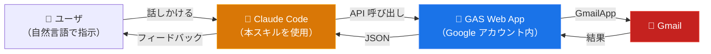

# 技術情報

[← README に戻る](../README.ja.md) ・ [English](technical-details.md)

## 構造

ccskill-gmail は、GCP の Gmail API を使用しません。その代わり、認証ユーザのみが使用できるブリッジ API を GAS プロジェクトとしてデプロイします。これを Claude Code が使用する構造となっています。

GAS Web App は登録 Google アカウントごとに 1 つデプロイされ、全ディレクトリで共有されます。操作対象のアカウントは呼び出しごとに「明示の `--account` > ディレクトリ固定（`bind`） > デフォルトアカウント」の順で決まります。各 Web App へのアクセスはデプロイした Google アカウント自身（MYSELF）に制限されます。

## 権限について

セットアップ中、Google から権限の許可を求められます。

**clasp 関連の権限（セットアップ時）**

| 権限 | 用途 |
|---|---|
| Google Drive ファイルの参照・管理 | GAS プロジェクトファイルの作成・更新 |
| Apps Script プロジェクトの参照・管理 | GAS プロジェクトの作成・コード push |
| デプロイの参照・管理 | Web App のデプロイ |

clasp（GAS を CLI で扱うための Google 公式ツール）が要求する標準的な権限です。本スキルでは clasp を使用するために必要となります。

**Gmail の権限（初回利用時）**

| 権限（OAuth スコープ） | 用途 |
|---|---|
| `gmail.readonly` | メール検索・閲覧、ラベル一覧、添付ファイルのダウンロード |
| `gmail.compose` | 下書きの作成・編集 |
| `gmail.modify` | 既読/未読、ラベル追加/削除、アーカイブ、ゴミ箱移動 |

必要最小限のスコープのみ要求しています。`gmail.send` スコープは要求しません。

## スキル定義ドキュメント

API の仕様やトラブルシューティングは、スキル定義ドキュメントを参照してください:

- [SKILL.md](../.claude/skills/ccskill-gmail/SKILL.md) — API 仕様とルール
- [examples.md](../.claude/skills/ccskill-gmail/examples.md) — ワークフロー例
- [troubleshooting.md](../.claude/skills/ccskill-gmail/troubleshooting.md) — よくある問題と解決策
