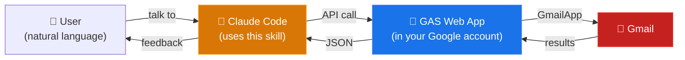

# Technical details

[← Back to README](../README.md) ・ [日本語版](technical-details.ja.md)

## Architecture

ccskill-gmail does not use the GCP Gmail API. Instead, it deploys a bridge API as a GAS (Google Apps Script) project accessible only to the authenticated user, and Claude Code calls that bridge.

One GAS Web App is deployed per registered Google account (and shared by all directories), with the account chosen per call: explicit `--account` > directory pin (`bind`) > default account. Access to each Web App is restricted to the deploying Google account itself (MYSELF).

## Permissions

During setup, Google will ask you to grant permissions.

**clasp permissions (during setup)**

| Permission | What it's for |
|---|---|
| View and manage Google Drive files | Create and update GAS project files |
| View and manage Apps Script projects | Create the GAS project and push code |
| View and manage deployments | Deploy the Web App |

These are the standard permissions clasp (Google's official CLI for GAS) requests. ccskill-gmail relies on clasp, so they are required.

**Gmail permissions (on first use)**

| Permission (OAuth scope) | What it's for |
|---|---|
| `gmail.readonly` | Search and read mail, list labels, download attachments |
| `gmail.compose` | Create and edit drafts |
| `gmail.modify` | Toggle read/unread, add/remove labels, archive, move to trash |

Only the minimum scopes required are requested. The `gmail.send` scope is **not** requested.

## Skill definition documents

For API specifications and troubleshooting, see the skill definition documents:

- [SKILL.md](../.claude/skills/ccskill-gmail/SKILL.md) — API specification and rules
- [examples.md](../.claude/skills/ccskill-gmail/examples.md) — Workflow examples
- [troubleshooting.md](../.claude/skills/ccskill-gmail/troubleshooting.md) — Common issues and solutions
