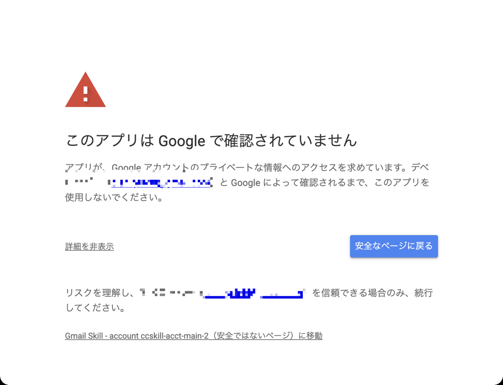
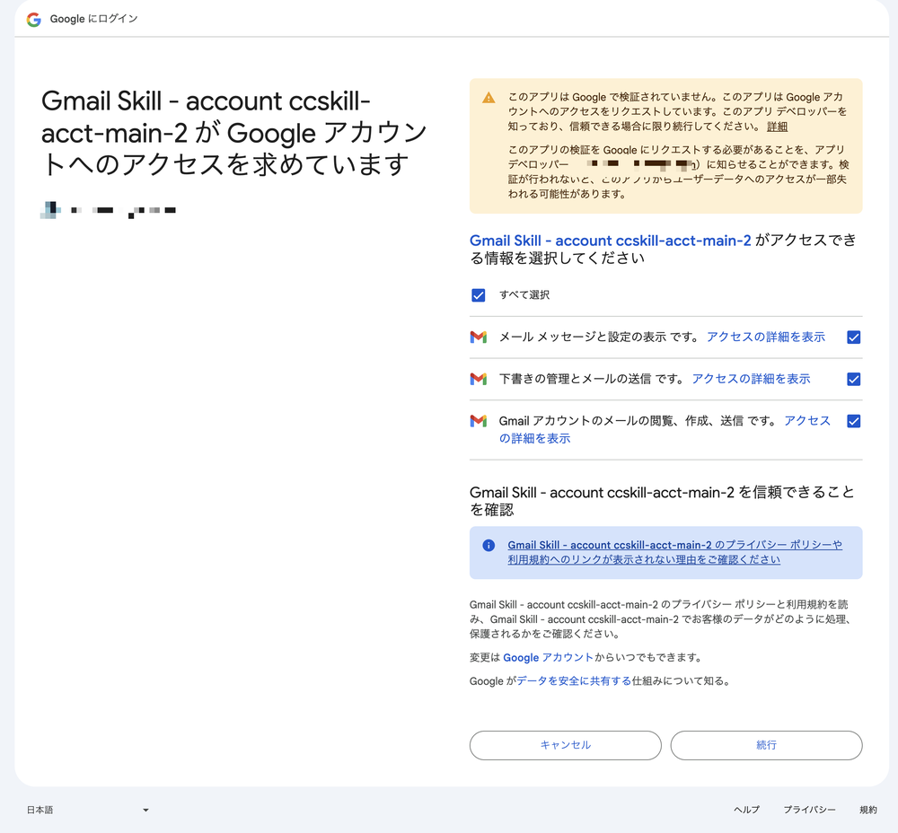

# トラブルシューティング

[← README に戻る](../README.ja.md) ・ [English](troubleshooting.md)

## アカウント登録が途中で失敗した場合

`ccskill-gmail account add` を再度実行してください。失敗時に GAS プロジェクトが Google 側に残ることがあります。[script.google.com](https://script.google.com) から手動で削除してから再実行してください。

## ブラウザが開いた時にリダイレクトループエラーや、「ファイルを開くことができません」のエラーが表示される

既にブラウザで複数 Google アカウントでログインしていたり、別アカウントのセッションが残っている場合に発生します。以下の手順を試して下さい。

1. ターミナルに表示された **認証 URL** をコピーする（`https://script.google.com/macros/s/...` で始まる URL）
2. **新しいシークレットウィンドウ**を開く（既存のシークレットウィンドウがあれば全て閉じる）
3. [accounts.google.com](https://accounts.google.com) にアクセスして紐づけたい Gmail の Google アカウントでログインする
4. 同じウィンドウで、1.でコピーした認証 URL をアドレスバーに貼り付けて開く
5. 「許可」をクリックする

**重要:**
- ブラウザのエラーページに表示される URL はコピーしないでください。必ず**ターミナルに表示されたURL**を使ってください
- コピーした認証URLを開く**前に**、accounts.google.com でログインしてください。先に認証URLを開くと同じリダイレクトループが発生します

## 「このアプリは Google で確認されていません」と表示される（個人 Google アカウント）

個人の Google アカウント（`@gmail.com`）を登録すると、認可時に「このアプリは Google で確認されていません」という警告が出ます。ccskill-gmail は各自のアカウントに自前の GAS を建て、Gmail の機微な権限を使う設計で、Google の公開審査を受けていないためです。自分で作って自分が許可するスクリプトなので、進めて問題ありません。

1. 「詳細」をクリック
2. 「（プロジェクト名）（安全ではないページ）に移動」をクリック
3. 権限一覧でチェックボックスをONにして「許可」

Google Workspace アカウントでの登録の場合、この警告が出ないことがあります。

## マルチアカウントのOAuth認証エラー

複数アカウントの利用で認証エラーが発生する場合は `ccskill-gmail doctor` を実行してください。clasp のログイン状態、OAuth トークン、アカウントレジストリ、エンドポイント接続まで一通りチェックし、問題箇所と修正方法を提示します。

## update 後に正常動作しない場合

`ccskill-gmail doctor` で診断してください。問題が解決しない場合は `ccskill-gmail update --force` で GAS プロジェクトを再デプロイしてください。

## 変更や操作が反映されない場合

意図したのと別のデプロイを使っている可能性があります — 同じアカウントでも、古いプロジェクト専用のデプロイと、共有のデプロイが併存することがあります。`ccskill-gmail api whoami` を実行し `endpoint` を確認してください。共有のデプロイを指している場合、コード変更は `ccskill-gmail account update` で反映します（プロジェクトの `update --force` は古いプロジェクト専用のデプロイのみ更新するため反映されません）。
